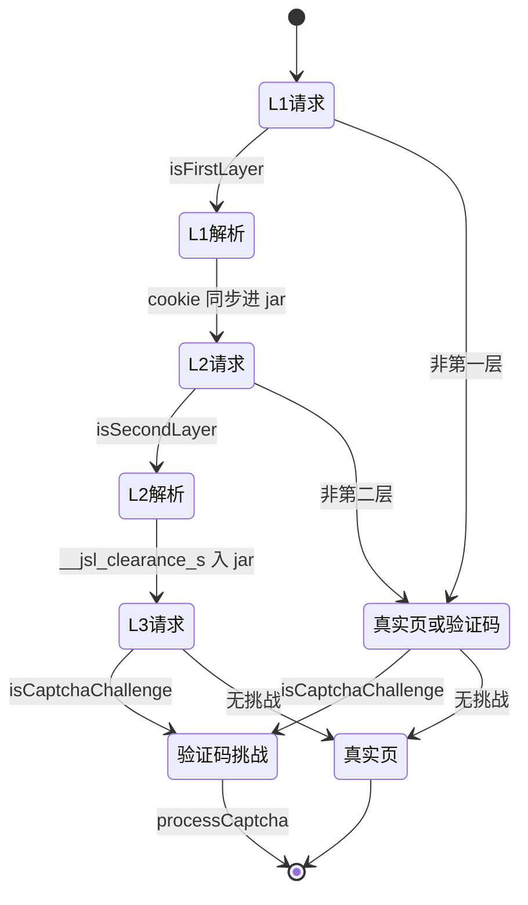
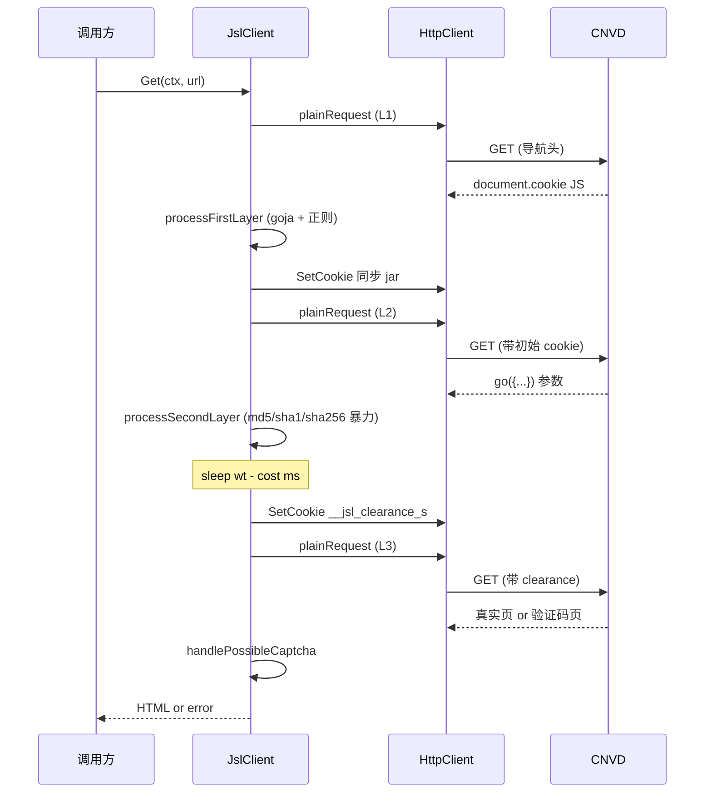
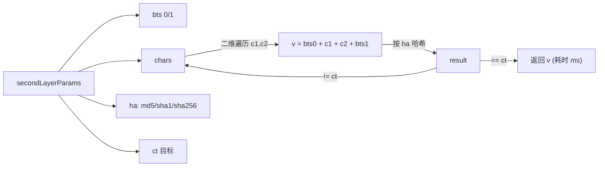

# 三层解密深度解析

加速乐（JSL）通过三层 JS 挑战逐步发放 `__jsl_clearance_s` cookie，`JslClient.Get` 自动完成三层解密并在第三层检测验证码挑战。源码位置：[`gojsl/client.go`](https://github.com/scagogogo/cnvd-skills/blob/main/gojsl/client.go)。

## 三层职责

| 层 | 响应特征 | 解析动作 | 产出 cookie |
|----|----------|----------|-------------|
| 第一层 | `` | goja 求值 JS 得 `name=value;Max-age=...`，兼容正则提取 | 初始 cookie（如 `__jsluid_s`） |
| 第二层 | 含 `go({...})` + `"tn":"__jsl_clearance"` + `"ct":"` + `})</script>` 结尾 | 解析 `secondLayerParams`，对 chars 二维暴力匹配 md5/sha1/sha256 | `__jsl_clearance_s` |
| 第三层 | 带 cookie GET | 返回真实页或验证码挑战页 | 无（可能触发验证码） |

## 三层状态机

## 调用时序

## 第二层算法

`processSecondLayer` 解析 `secondLayerParams`（字段 `bts/chars/ct/ha/tn/vt/wt`，详见 [secondLayerParams](/api-gojsl/types/second-layer-params)），对 `chars` 做二维遍历构造候选串 `v = bts[0] + c1 + c2 + bts[1]`，按 `ha` 字段（md5/sha1/sha256）计算哈希，匹配 `ct` 即得 cookie 值。

## wt 休眠

`processSecondLayer` 用解析出的 `wt` 做休眠（而非硬编码 1500ms），先扣除本层计算耗时 `cost`，剩余 `wt - cost` 毫秒休眠；`wt` 解析失败或 ≤0 时回退 1500ms。这抵抗加速乐调整 `wt/vt`。

## 兼容正则

第一层 JS 求值后得到 `name=value;Max-age=...` 字符串，正则 `(.+?)=(.+?);\s*[Mm]ax-[Aa]ge` 覆盖 `;max-age` / `; Max-age` / `; Max-Age` 等大小写与空格组合，修复了原始库正则不兼容 `; Max-age` 大写带空格的问题。

## 验证码挑战检测

`isCaptchaChallenge(body)` 判断响应体是否含 `本站开启了验证码保护` 或 `/cdn-cgi/js/captcha.js`。若是且配置了 solver，走 `processCaptcha`（最多 6 次重试，详见 [processCaptcha 内部](/api-gojsl/methods/process-captcha-internals)）；否则返回 `ErrCaptchaRequired`。

## 创宇盾拦截检测

`plainRequest` 检测响应体是否含 `当前访问疑似黑客攻击，已被创宇盾拦截。`，若是返回错误 `blocked by 创宇盾 (proxy may be banned)`。排查见 [FAQ - 代理被封](/faq/proxy-banned)。
