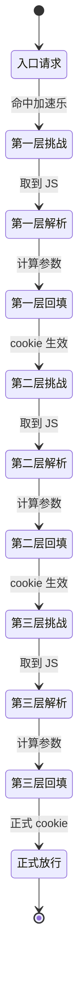

# 三层解密深度解析

本页深入说明加速乐三层解密的内部状态与转移条件。

## 三层状态机

每一层均包含"挑战-解析-回填 cookie"循环，逐层放行。

```mermaid
stateDiagram-v2
    [*] --> 入口请求
    入口请求 --> 第一层挑战: 命中加速乐
    第一层挑战 --> 第一层解析: 取到 JS
    第一层解析 --> 第一层回填: 计算参数
    第一层回填 --> 第二层挑战: cookie 生效
    第二层挑战 --> 第二层解析: 取到 JS
    第二层解析 --> 第二层回填: 计算参数
    第二层回填 --> 第三层挑战: cookie 生效
    第三层挑战 --> 第三层解析: 取到 JS
    第三层解析 --> 第三层回填: 计算参数
    第三层回填 --> 正式放行: 正式 cookie
    正式放行 --> [*]
```

> 本页内容将在后续任务填充。
