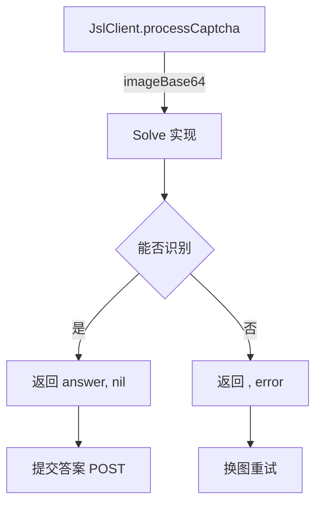

# CaptchaSolver 接口详解

`CaptchaSolver` 是 go-jsl 验证码识别的扩展点。源码：[`gojsl/captcha.go`](https://github.com/scagogogo/cnvd-skills/blob/main/gojsl/captcha.go)。

## 接口定义

```go
type CaptchaSolver interface {
    Solve(ctx context.Context, imageBase64 string) (string, error)
}
```

## 方法契约

| 方法 | 参数 | 返回 | 语义 |
|------|------|------|------|
| `Solve` | `ctx context.Context`：用于取消；`imageBase64 string`：base64 编码的 PNG 图片 | `(string, error)`：识别出的答案；error 表示无法识别 | 库会换一张图重试 |

`imageBase64` 与 CNVD captcha 端点返回的 `image` 字段同格式（标准 base64，可直接 `base64.StdEncoding.DecodeString` 解码为 PNG 字节）。

## 实现者职责



实现要点：
- 返回 error 时库会换图重试，最多 6 次（见 [processCaptcha 内部](/api-gojsl/methods/process-captcha-internals)）。
- `ctx` 应被尊重，长任务（如等待人工）需 `select <-ctx.Done()`。
- 答案字符串应去除首尾空白（库不 trim，由实现负责）。

## 内置实现

详见 [Solver 实现详解](/api-gojsl/solver-implementations) 与各实现页：

- [NoopCaptchaSolver](/api-gojsl/types/noop-captcha-solver)
- [InteractiveCaptchaSolver](/api-gojsl/types/interactive-captcha-solver)
- [StaticCaptchaSolver](/api-gojsl/types/static-captcha-solver)
- [CommandCaptchaSolver](/api-gojsl/types/command-captcha-solver)

## 自定义实现示例

```go
type MySolver struct{}
func (MySolver) Solve(ctx context.Context, imageBase64 string) (string, error) {
    return callMyOCR(ctx, imageBase64)
}
```

详见 [示例 - 自定义 Solver](/api-gojsl/examples/custom-solver)。

## 相关

- [Solve 方法](/api-gojsl/methods/solve)
- [CaptchaSolver 概览](/api-gojsl/captcha-solver)
