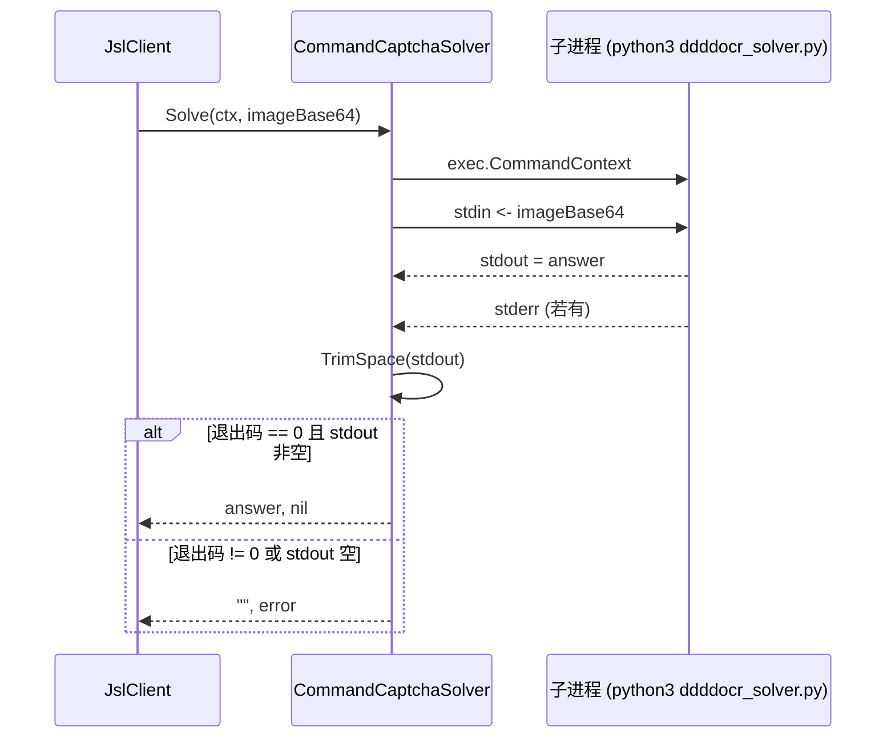

# CommandCaptchaSolver

`CommandCaptchaSolver` 通过调用外部命令识别验证码：把 base64 图片通过 stdin 传入命令，从 stdout 读答案。源码：[`gojsl/captcha.go`](https://github.com/scagogogo/cnvd-skills/blob/main/gojsl/captcha.go)。

## 定义

```go
type CommandCaptchaSolver struct {
    Command string
    Args    []string
}

func (s CommandCaptchaSolver) Solve(ctx context.Context, imageBase64 string) (string, error)
```

## 字段

| 字段 | 类型 | 语义 |
|------|------|------|
| `Command` | `string` | 可执行命令名，如 `"python3"` |
| `Args` | `[]string` | 命令参数，如 `[]string{"scripts/ddddocr_solver.py"}` |

## 行为

`Solve` 起子进程：stdin 写 base64 图片，stdout 读答案，stderr 收集错误信息。命令退出码非 0 视为识别失败（返回 wrap 错误）；stdout 为空也视为失败。返回前对 stdout 做 `strings.TrimSpace`。



## 配合 ddddocr

仓库提供 `scripts/ddddocr_solver.py`（读取 stdin base64 → ddddocr 识别 → stdout 输出答案）。安装见 [FAQ - ddddocr 安装](/faq/ddddocr-install)。

```go
solver := jsl.CommandCaptchaSolver{
    Command: "python3",
    Args:    []string{"scripts/ddddocr_solver.py"},
}
client := jsl.NewJslClient("", 60, solver)
```

## 示例

```go
package main

import (
    "context"
    "log"

    "github.com/scagogogo/go-jsl"
)

func main() {
    client := jsl.NewJslClient("", 60, jsl.CommandCaptchaSolver{
        Command: "python3",
        Args:    []string{"scripts/ddddocr_solver.py"},
    })
    html, err := client.Get(context.Background(), "https://www.cnvd.org.cn/")
    if err != nil {
        log.Fatal(err)
    }
    log.Printf("html length: %d", len(html))
}
```

详见 [示例 - 验证码全自动](/api-gojsl/examples/captcha-auto)。

## 设计动机

保持 gojsl 为纯 Go，识别能力按需接入：OCR/打码平台用各自语言实现为可执行命令，Go 侧只做 stdin/stdout 桥接，无需 cgo 或 Python 嵌入。

## 相关

- [CaptchaSolver 接口](/api-gojsl/types/captcha-solver-interface)
- [验证码全自动示例](/api-gojsl/examples/captcha-auto)
- [ddddocr 安装](/faq/ddddocr-install)
