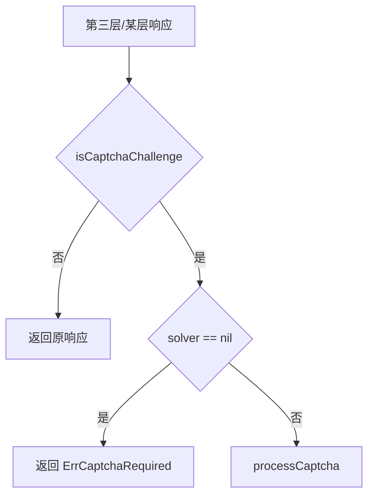

# ErrCaptchaRequired 详解

`ErrCaptchaRequired` 表示响应为验证码挑战页但未配置 `CaptchaSolver`。源码：[`gojsl/captcha.go`](https://github.com/scagogogo/cnvd-skills/blob/main/gojsl/captcha.go)。

## 定义

```go
var ErrCaptchaRequired = errors.New("captcha challenge required but no solver configured")
```

## 触发条件

`JslClient.handlePossibleCaptcha` 检测到 `isCaptchaChallenge(body)` 为 true 且 `x.solver == nil` 时返回此错误。



另外 `NoopCaptchaSolver.Solve` 也返回此错误（语义等价于 nil solver）。

## errors.Is 用法

```go
if errors.Is(err, jsl.ErrCaptchaRequired) {
    // 需配置识别器
    client := jsl.NewJslClient("", 60, jsl.CommandCaptchaSolver{
        Command: "python3",
        Args:    []string{"scripts/ddddocr_solver.py"},
    })
    _ = client
}
```

## 排查

- 确认构造 `JslClient` 时第三参数非 nil。
- 若用 `NoopCaptchaSolver`，换成 `CommandCaptchaSolver` 或 `InteractiveCaptchaSolver`。
- 详见 [FAQ - 遇 ErrCaptchaRequired 怎么办](/faq/captcha-required-error)。

## 相关

- [错误变量](/api-gojsl/errors)
- [NoopCaptchaSolver](/api-gojsl/types/noop-captcha-solver)
- [processCaptcha 内部](/api-gojsl/methods/process-captcha-internals)
