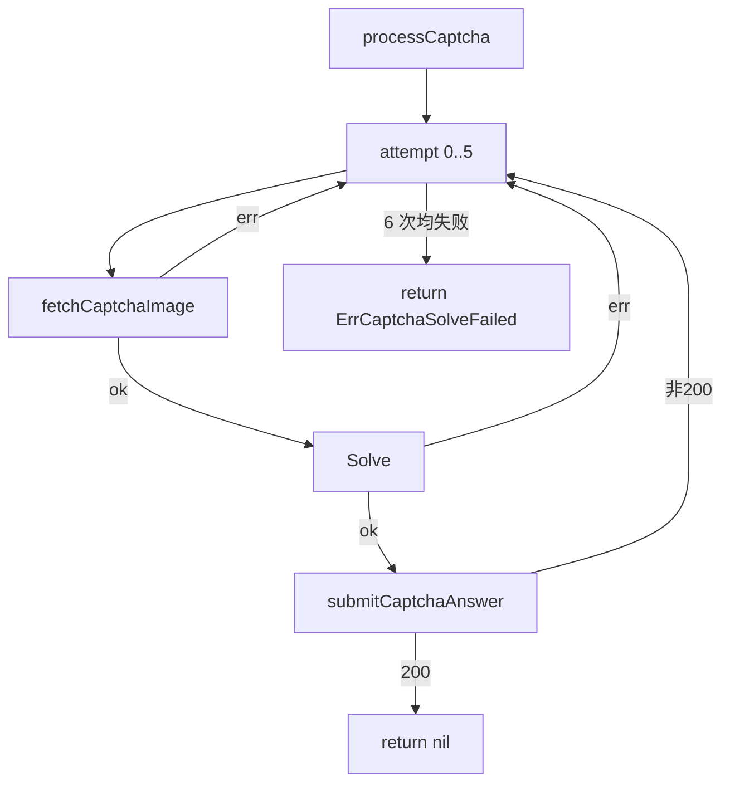

# ErrCaptchaSolveFailed 详解

`ErrCaptchaSolveFailed` 表示配置了 solver 但多次识别/提交均失败。源码：[`gojsl/captcha.go`](https://github.com/scagogogo/cnvd-skills/blob/main/gojsl/captcha.go)。

## 定义

```go
var ErrCaptchaSolveFailed = errors.New("captcha solve failed after retries")
```

## 触发条件

`JslClient.processCaptcha` 最多重试 `maxAttempts = 6` 次，每次取图→识别→提交，全部失败后返回此错误。失败原因可能是：
- `fetchCaptchaImage` 取图失败（端点返回非 200 或 JSON 解析失败）。
- `solver.Solve` 返回 error。
- `submitCaptchaAnswer` 提交失败（端点返回非 200，错误答案通常返回 401）。



此外 `InteractiveCaptchaSolver` 等待超时时返回 `fmt.Errorf("%w: timeout waiting for %s", ErrCaptchaSolveFailed, envName)`，`errors.Is` 仍可命中。

## errors.Is 用法

```go
if errors.Is(err, jsl.ErrCaptchaSolveFailed) {
    log.Println("识别失败，检查 ddddocr 或换识别器")
}
```

## 排查

- ddddocr 是否正确安装（见 [FAQ - ddddocr 安装](/faq/ddddocr-install)）。
- `CommandCaptchaSolver` 的 Command/Args 是否正确，子进程 stderr 可在错误信息中看到。
- 验证码图是否为中文词组（ddddocr 识别有概率性，6 次重试通常足够）。
- 详见 [FAQ - 识别失败排查](/faq/captcha-solve-failed)。

## 相关

- [错误变量](/api-gojsl/errors)
- [processCaptcha 内部](/api-gojsl/methods/process-captcha-internals)
- [InteractiveCaptchaSolver](/api-gojsl/types/interactive-captcha-solver)
