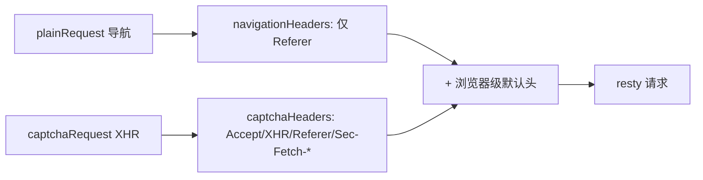

# Header 策略

go-jsl 维护两类 Header 策略：浏览器级默认头（由 `userAgent.headers()` 全套设到 client）与按场景附加头（`captchaHeaders` / `navigationHeaders`）。未导出但文档说明。源码：[`gojsl/headers.go`](https://github.com/scagogogo/cnvd-skills/blob/main/gojsl/headers.go)。

## 浏览器级默认头

由 `userAgent.headers()` 返回，`NewHttpClient` 时 `applyBrowserHeaders` 全套设到 resty client 默认头。覆盖：

| Header | 值 | 说明 |
|--------|----|------|
| `User-Agent` | `ua.ua` | 与 major/platform 联动 |
| `Accept` | `text/html,...` | 导航请求标准 |
| `Accept-Language` | `zh-CN,zh;q=0.9` | 中文优先 |
| `Accept-Encoding` | `gzip, deflate` | 不带 br，避免某些代理问题 |
| `sec-ch-ua` | `Chromium;v=major, Not(A:Brand;v=24, Google Chrome;v=major` | Client Hints |
| `sec-ch-ua-mobile` | `?0` | 桌面端 |
| `sec-ch-ua-platform` | `"platform"` | 与 UA 平台联动 |
| `Sec-Fetch-Site` | `same-origin` | Fetch Metadata |
| `Sec-Fetch-Mode` | `navigate` | 导航请求 |
| `Sec-Fetch-User` | `?1` | 用户触发 |
| `Sec-Fetch-Dest` | `document` | 目标为文档 |
| `Upgrade-Insecure-Requests` | `1` | 支持 HTTPS 升级 |
| `Connection` | `keep-alive` | 连接复用 |

## captchaHeaders（XHR 专用）

验证码端点（XHR）专用附加头，由 `captchaRequest` 调用：

```go
func captchaHeaders(referer string) map[string]string {
    return map[string]string{
        "Accept":           "application/json, text/javascript, */*; q=0.01",
        "X-Requested-With": "XMLHttpRequest",
        "Referer":          referer,
        "Sec-Fetch-Site":   "same-origin",
        "Sec-Fetch-Mode":   "cors",
        "Sec-Fetch-Dest":   "empty",
    }
}
```

> 现代浏览器 fetch 不发 `X-Requested-With`，但 CNVD 的 captcha.js 仍检查它，故保留。`Referer` 由调用方按目标 URL 传入。

## navigationHeaders（导航专用）

普通页面导航请求的附加头，由 `plainRequest` 调用：

```go
func navigationHeaders(referer string) map[string]string {
    h := map[string]string{}
    if referer != "" {
        h["Referer"] = referer
    }
    return h
}
```

## 场景对照



## 覆盖语义

`extraHeaders` 通过 `req.SetHeader(k, v)` 设置，会覆盖默认头（resty 的 SetHeader 是覆盖语义）。故 `captchaHeaders` 的 `Accept`、`Sec-Fetch-*` 会覆盖导航默认值，符合 XHR 场景。

## 相关

- [userAgent 内部](/api-gojsl/types/user-agent-internals)
- [架构 - 隐蔽性强化](/architecture/stealth)
- [HttpClient 结构](/api-gojsl/types/http-client-struct)
