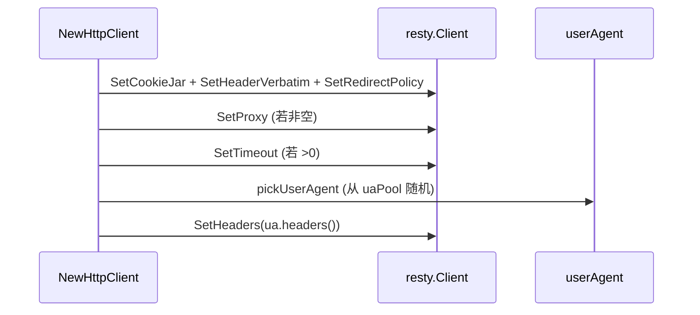

# HttpClient 结构

`HttpClient` 字段均未导出，外部通过 `NewHttpClient` 构造、通过方法访问。源码：[`gojsl/httpclient.go`](https://github.com/scagogogo/cnvd-skills/blob/main/gojsl/httpclient.go)。

## 结构定义

```go
type HttpClient struct {
    client *resty.Client
    mu     sync.Mutex
    ua     userAgent
}
```

## 字段语义

| 字段 | 类型 | 未导出 | 语义 |
|------|------|--------|------|
| `client` | `*resty.Client` | 是 | 长生命周期 resty 客户端，复用 TCP/TLS 连接、持有 cookie jar |
| `mu` | `sync.Mutex` | 是 | 保护 `ua` 轮换（`RefreshUserAgent` 加锁） |
| `ua` | `userAgent` | 是 | 当前选中的 UA（含 Client Hints 联动），见 [userAgent 内部](/api-gojsl/types/user-agent-internals) |

## 构造时初始化

`NewHttpClient` 构造时：启用 cookie jar、设置 `Accept-Language: zh-CN,zh;q=0.9`、设 FlexibleRedirectPolicy(10)；按需设代理与超时；调用 `pickUserAgent` 从 UA 池随机选一个，`applyBrowserHeaders` 把对应浏览器级 Header 全套设到 client 默认头。



## 与 JslClient 的关系

`JslClient.httpClient` 指向一个 `HttpClient`，所有三层解密请求与验证码请求都经它，确保连接复用与会话连续。详见 [JslClient 结构](/api-gojsl/types/jsl-client-struct)。

## 相关

- [HttpClient 类型](/api-gojsl/http-client)
- [UA 池内部](/api-gojsl/types/ua-pool-internals)
- [Header 策略](/api-gojsl/types/headers-strategy)
