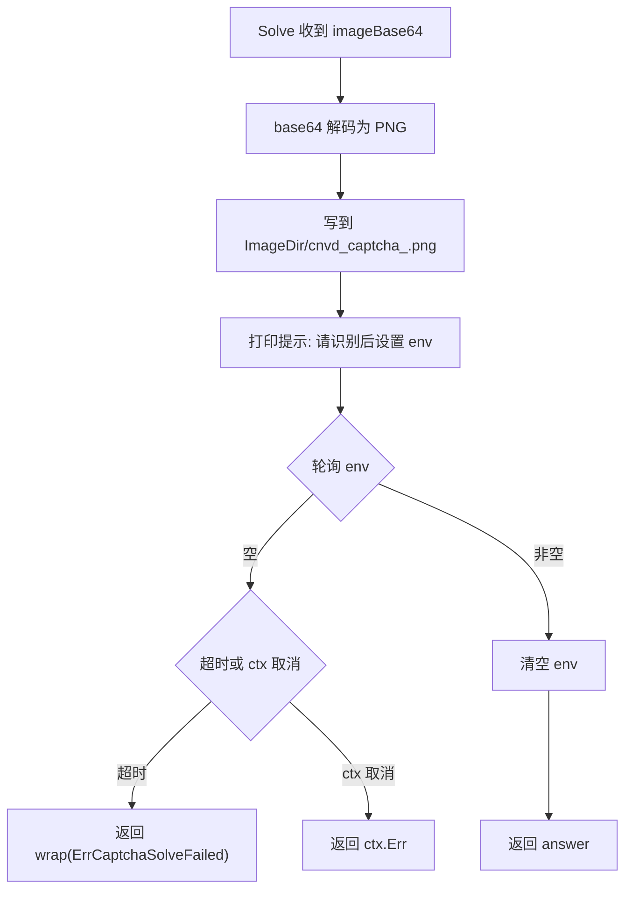

# InteractiveCaptchaSolver

`InteractiveCaptchaSolver` 是半自动识别器：把验证码图写到磁盘临时文件，然后轮询环境变量等待人工或外部脚本填入答案。源码：[`gojsl/captcha.go`](https://github.com/scagogogo/cnvd-skills/blob/main/gojsl/captcha.go)。

## 定义

```go
type InteractiveCaptchaSolver struct {
    AnswerEnv    string
    ImageDir     string
    WaitTimeout  time.Duration
    PollInterval time.Duration
}

func (s InteractiveCaptchaSolver) Solve(ctx context.Context, imageBase64 string) (string, error)
```

## 字段

| 字段 | 类型 | 默认 | 语义 |
|------|------|------|------|
| `AnswerEnv` | `string` | `CNVD_CAPTCHA_ANSWER` | 答案环境变量名 |
| `ImageDir` | `string` | `os.TempDir()` | 验证码图保存目录 |
| `WaitTimeout` | `time.Duration` | `5 * time.Minute` | 等待答案的最长时间 |
| `PollInterval` | `time.Duration` | `1 * time.Second` | 轮询间隔 |

零值字段会在 `Solve` 内部回退到默认值，故可仅配置关心的字段。

## 行为流程



## 环境变量约定

写入答案示例（bash）：

```bash
export CNVD_CAPTCHA_ANSWER="加速乐"
```

`Solve` 读到后立即 `os.Setenv(envName, "")` 清空，避免下一轮重试读到旧答案。

## 示例

```go
package main

import (
    "context"
    "time"

    "github.com/scagogogo/go-jsl"
)

func main() {
    solver := jsl.InteractiveCaptchaSolver{
        AnswerEnv:    "MY_CAPTCHA_ANSWER",
        ImageDir:     "/tmp/cnvd-captcha",
        WaitTimeout:  10 * time.Minute,
        PollInterval: 2 * time.Second,
    }
    client := jsl.NewJslClient("", 60, solver)
    _, _ = client.Get(context.Background(), "https://www.cnvd.org.cn/")
}
```

配套外部脚本可在 `Solve` 等待期间往 `/tmp/cnvd-captcha/*.png` 看图并 `export MY_CAPTCHA_ANSWER=...`。详见 [示例 - 验证码交互](/api-gojsl/examples/captcha-interactive)。

## 超时与错误

`WaitTimeout` 到期返回 `fmt.Errorf("%w: timeout waiting for %s", ErrCaptchaSolveFailed, envName)`，`errors.Is(err, ErrCaptchaSolveFailed)` 命中。`ctx` 取消返回 `ctx.Err()`。

## 相关

- [CaptchaSolver 接口](/api-gojsl/types/captcha-solver-interface)
- [ErrCaptchaSolveFailed 详解](/api-gojsl/types/err-captcha-solve-failed)
- [验证码交互示例](/api-gojsl/examples/captcha-interactive)
