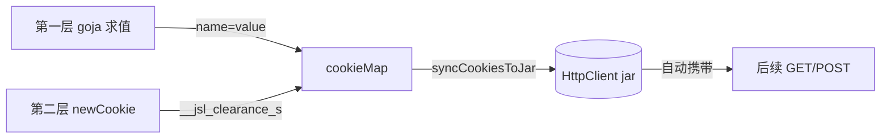

# JslClient 结构

`JslClient` 的所有字段均未导出，外部仅能通过 `NewJslClient` 构造、通过方法访问。本页说明字段语义。源码：[`gojsl/client.go`](https://github.com/scagogogo/cnvd-skills/blob/main/gojsl/client.go)。

## 结构定义

```go
type JslClient struct {
    httpClient  *HttpClient
    cookieMap   map[string]string
    proxy       string
    timeout     time.Duration
    solver      CaptchaSolver
    targetSite  string
}
```

## 字段语义

| 字段 | 类型 | 未导出 | 语义 |
|------|------|--------|------|
| `httpClient` | `*HttpClient` | 是 | 统一 HTTP 客户端，三层解密每一跳与验证码流程都经它收发 |
| `cookieMap` | `map[string]string` | 是 | 解密中间产物（第一层 goja 算出、第二层 newCookie 算出），完成后同步进 jar |
| `proxy` | `string` | 是 | 代理地址，由 `NewJslClient` 传入并透传给 HttpClient |
| `timeout` | `time.Duration` | 是 | 超时，0 表示不限时；仅记录，实际由 HttpClient 落地 |
| `solver` | `CaptchaSolver` | 是 | 验证码识别器，nil 时遇验证码返回 `ErrCaptchaRequired` |
| `targetSite` | `string` | 是 | 站点根（`scheme://host`），用于把解密 cookie 写入 jar 作用域，首次请求后缓存 |

## cookieMap 与 jar 的协作

`cookieMap` 是解密算出的中间 cookie 暂存，`syncCookiesToJar` 调用 `HttpClient.SetCookie` 把它们写入 jar，由 jar 统一携带后续请求的 `Cookie` 头。



## targetSite 缓存

`ensureTargetSite` 从首次请求 URL 解析 `scheme://host` 缓存到 `targetSite`，后续请求复用，避免重复解析。`syncCookiesToJar` 在 `targetSite` 为空时跳过（保证 cookie 不写错作用域）。

## 相关

- [JslClient 类型](/api-gojsl/jsl-client)
- [HttpClient 结构](/api-gojsl/types/http-client-struct)
- [Cookie 生命周期](/architecture/cookie-lifecycle)
