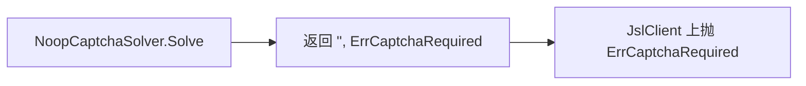

# NoopCaptchaSolver

`NoopCaptchaSolver` 永不识别，`Solve` 返回 `("", ErrCaptchaRequired)`。源码：[`gojsl/captcha.go`](https://github.com/scagogogo/cnvd-skills/blob/main/gojsl/captcha.go)。

## 定义

```go
type NoopCaptchaSolver struct{}

func (NoopCaptchaSolver) Solve(ctx context.Context, imageBase64 string) (string, error)
```

## 行为

无字段、无配置。`Solve` 直接返回 `("", ErrCaptchaRequired)`，等价于 `NewJslClient(..., nil)`，但语义更明确——表示"显式声明不识别"。



## 使用场景

- 明确要求调用方在更外层配置识别器，本层不做识别。
- 单测中验证 `JslClient` 遇验证码时正确返回 `ErrCaptchaRequired`。

## 示例

```go
package main

import (
    "context"
    "errors"
    "fmt"

    "github.com/scagogogo/go-jsl"
)

func main() {
    client := jsl.NewJslClient("", 30, jsl.NoopCaptchaSolver{})
    _, err := client.Get(context.Background(), "https://www.cnvd.org.cn/")
    if errors.Is(err, jsl.ErrCaptchaRequired) {
        fmt.Println("遇验证码且无识别器，符合预期")
    }
}
```

## 相关

- [CaptchaSolver 接口](/api-gojsl/types/captcha-solver-interface)
- [ErrCaptchaRequired 详解](/api-gojsl/types/err-captcha-required)
- [Solver 实现详解](/api-gojsl/solver-implementations)
