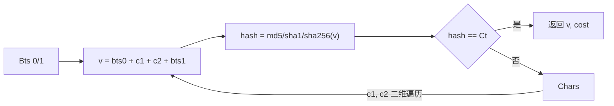

# secondLayerParams 第二层参数

`secondLayerParams` 是第二层 `go({...})` 参数的结构，复刻 jsl_sdk `SecondResponseParams`。未导出但文档说明字段语义。源码：[`gojsl/client.go`](https://github.com/scagogogo/cnvd-skills/blob/main/gojsl/client.go)。

## 结构定义

```go
type secondLayerParams struct {
    Bts   []string `json:"bts"`
    Chars string   `json:"chars"`
    Ct    string   `json:"ct"`
    Ha    string   `json:"ha"`
    Tn    string   `json:"tn"`
    Vt    string   `json:"vt"`
    Wt    string   `json:"wt"`
}
```

## 字段语义

| 字段 | 类型 | 语义 |
|------|------|------|
| `Bts` | `[]string` | 两段固定串，候选 `v = bts[0] + c1 + c2 + bts[1]` |
| `Chars` | `string` | 候选字符集，二维遍历 `c1 × c2` |
| `Ct` | `string` | 目标哈希值，匹配即得 cookie |
| `Ha` | `string` | 哈希算法：`md5` / `sha1` / `sha256` |
| `Tn` | `string` | cookie 名，通常 `__jsl_clearance_s` |
| `Vt` | `string` | （保留字段，破解算法未直接用） |
| `Wt` | `string` | 休眠毫秒数，破解后 `sleep(wt - cost)` |

## 破解流程

`newCookie(params)` 对 `Chars` 做二维遍历，构造 `v = bts[0] + c1 + c2 + bts[1]`，按 `Ha` 计算哈希，匹配 `Ct` 即返回 `v` 作为 cookie 值，并返回耗时毫秒。



## wt 休眠

`processSecondLayer` 用 `wt`（解析失败或 ≤0 回退 1500）减去 `cost`（`newCookie` 返回的耗时）作为休眠时长，剩余 > 0 时 `time.After`。这模拟浏览器执行 JS 的真实延迟，抵抗加速乐调整 `wt/vt`。

## 第二层判定

`isSecondLayer(body)` 宽松判断：以 `})</script>` 结尾且含 `"tn":"__jsl_clearance` 与 `"ct":"`，不再硬编码 `wt` 值，抵抗参数微调。

## 示例（概念）

```json
{
  "bts": ["aaa", "bbb"],
  "chars": "0123456789abcdef",
  "ct": "目标哈希",
  "ha": "md5",
  "tn": "__jsl_clearance_s",
  "vt": "...",
  "wt": "1500"
}
```

`newCookie` 遍历 `0..9a..f` × `0..9a..f`，对每个 `v = "aaa" + c1 + c2 + "bbb"` 算 md5，匹配 `ct` 即得 cookie 值。

## 相关

- [三层解密深度解析](/api-gojsl/three-layers-deep-dive)
- [JslClient 结构](/api-gojsl/types/jsl-client-struct)
- [架构 - 加速乐三层解密](/architecture/jsl-three-layers)
