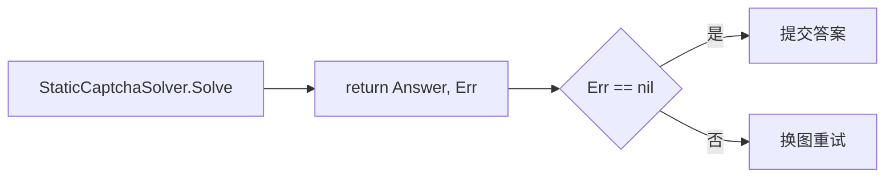

# StaticCaptchaSolver

`StaticCaptchaSolver` 返回固定答案，仅供单测。源码：[`gojsl/captcha.go`](https://github.com/scagogogo/cnvd-skills/blob/main/gojsl/captcha.go)。

## 定义

```go
type StaticCaptchaSolver struct {
    Answer string
    Err    error
}

func (s StaticCaptchaSolver) Solve(ctx context.Context, imageBase64 string) (string, error)
```

## 字段

| 字段 | 类型 | 语义 |
|------|------|------|
| `Answer` | `string` | 固定返回的答案 |
| `Err` | `error` | 固定返回的错误；非 nil 时库会换图重试 |

`Solve` 直接 `return s.Answer, s.Err`，不做任何识别。

## 行为



## 使用场景

- 单测中验证 `processCaptcha` 的重试逻辑：设 `Err` 模拟识别失败，断言 6 次后返回 `ErrCaptchaSolveFailed`。
- 验证某固定答案能通过提交端点。

## 示例

```go
package main

import (
    "context"
    "fmt"

    "github.com/scagogogo/go-jsl"
)

func main() {
    // 模拟识别失败
    failSolver := jsl.StaticCaptchaSolver{Err: fmt.Errorf("ocr down")}
    // 模拟固定答案
    okSolver := jsl.StaticCaptchaSolver{Answer: "测试"}

    _ = failSolver
    _ = okSolver
    _ = context.Background()
}
```

## 相关

- [CaptchaSolver 接口](/api-gojsl/types/captcha-solver-interface)
- [processCaptcha 内部](/api-gojsl/methods/process-captcha-internals)
- [Solver 实现详解](/api-gojsl/solver-implementations)
