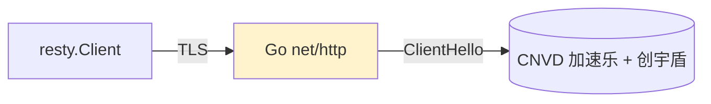
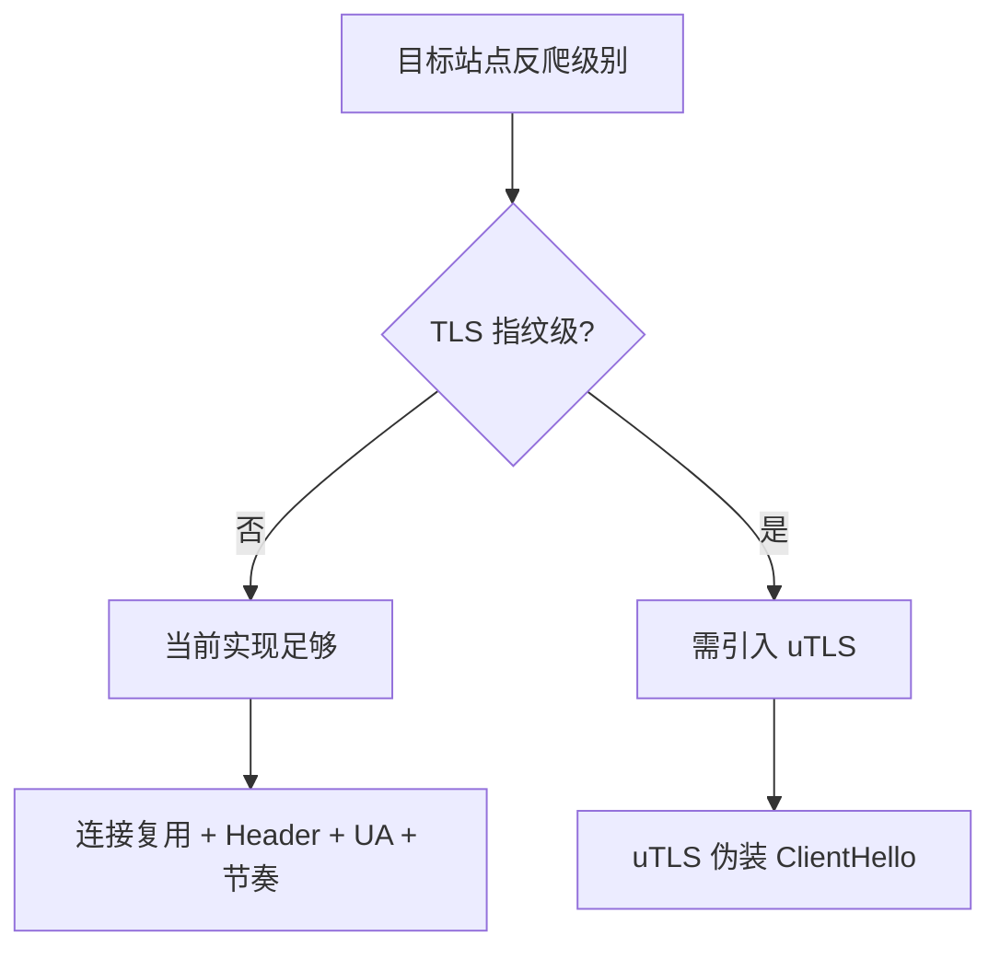

# TLS 指纹未伪装范围

go-jsl 当前隐蔽性聚焦在连接复用、Header、UA、节奏四维，底层 TLS ClientHello 仍用 Go 标准库 `net/http`，未引入 uTLS。本页说明未伪装的范围与已验证场景。

## 当前覆盖与未覆盖

| 维度 | 状态 | 实现 |
|------|------|------|
| 连接复用 | ✓ 已覆盖 | 长生命周期 resty client，keep-alive |
| cookie jar | ✓ 已覆盖 | `net/http/cookiejar` 自动管理 |
| 浏览器级 Header | ✓ 已覆盖 | Client Hints + Fetch Metadata + UA 联动 |
| UA 池随机 | ✓ 已覆盖 | 4 个真实 Chrome 121/122 |
| 节奏抖动 | ✓ 已覆盖 | 翻页/详情间隔 ±30%，验证码 500~1500ms 反应延迟 |
| TLS ClientHello 指纹 | ✗ 未伪装 | Go 标准库 net/http，未用 uTLS |
| JA3/JA4 指纹 | ✗ 未伪装 | 同上 |

## 已验证场景

已验证可正常穿透 CNVD 加速乐三层 + 创宇盾验证码挑战。CNVD 当前反爬未到 TLS 指纹级，故不引入 uTLS 的复杂依赖。

## 何时需引入 uTLS

若目标站点升级到 TLS 指纹级反爬（如基于 JA3/JA4 拦截 Go 标准库指纹），需引入 [uTLS](https://github.com/refraction-networking/utls) 伪装 ClientHello。届时本页将更新实现细节。

## 决策矩阵

## 相关

- [架构 - TLS 指纹决策](/architecture/tls-fingerprint)
- [架构 - 隐蔽性强化](/architecture/stealth)
- [Header 策略](/api-gojsl/types/headers-strategy)
- [README - 隐蔽性](https://github.com/scagogogo/cnvd-skills/blob/main/gojsl/README.md)
