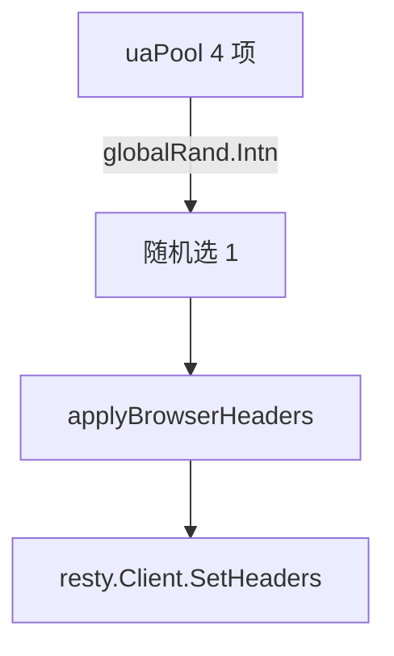

# uaPool 内部

`uaPool` 是真实 Chrome 稳定大版本 UA 池，每项 UA 与 `major`/`platform` 联动。未导出但文档说明。源码：[`gojsl/headers.go`](https://github.com/scagogogo/cnvd-skills/blob/main/gojsl/headers.go)。

## 池内容

```go
var uaPool = []userAgent{
    {ua: "Mozilla/5.0 (Windows NT 10.0; Win64; x64) AppleWebKit/537.36 (KHTML, like Gecko) Chrome/122.0.0.0 Safari/537.36", major: "122", platform: "Windows"},
    {ua: "Mozilla/5.0 (Windows NT 10.0; Win64; x64) AppleWebKit/537.36 (KHTML, like Gecko) Chrome/121.0.0.0 Safari/537.36", major: "121", platform: "Windows"},
    {ua: "Mozilla/5.0 (Macintosh; Intel Mac OS X 10_15_7) AppleWebKit/537.36 (KHTML, like Gecko) Chrome/122.0.0.0 Safari/537.36", major: "122", platform: "macOS"},
    {ua: "Mozilla/5.0 (X11; Linux x86_64) AppleWebKit/537.36 (KHTML, like Gecko) Chrome/121.0.0.0 Safari/537.36", major: "121", platform: "Linux"},
}
```

## 4 个 UA 矩阵

| UA | major | platform |
|----|-------|----------|
| Chrome 122 Windows | 122 | Windows |
| Chrome 121 Windows | 121 | Windows |
| Chrome 122 macOS | 122 | macOS |
| Chrome 121 Linux | 121 | Linux |



## 选择逻辑

```go
func randomUserAgent() userAgent {
    return uaPool[globalRand.Intn(len(uaPool))]
}
```

`globalRand` 是全局 `*rand.Rand`，播种见 [globalRand 内部](/api-gojsl/types/global-rand-internals)。每次构造 `HttpClient` 时随机选一个；长会话可调 `RefreshUserAgent()` 轮换。

## 设计考量

- 只用真实稳定大版本（121/122），避免冷门/伪造版本被反爬特征化。
- UA 与 `sec-ch-ua` 大版本、`sec-ch-ua-platform` 三者联动，保证 Client Hints 一致性。
- 覆盖 Win/Mac/Linux 三大平台，贴近真实浏览器分布。

## 相关

- [userAgent 内部](/api-gojsl/types/user-agent-internals)
- [globalRand 内部](/api-gojsl/types/global-rand-internals)
- [UA 轮换示例](/api-gojsl/examples/ua-rotation)
- [架构 - UA 池与 Client Hints](/architecture/ua-pool)
