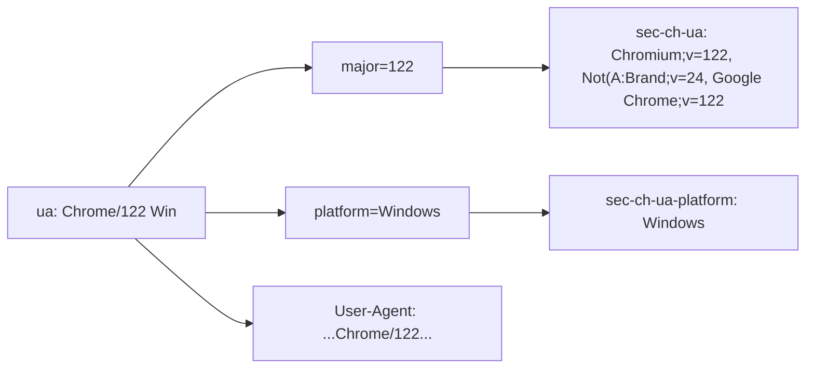

# userAgent 内部结构

`userAgent` 封装一个真实 Chrome 浏览器的 UA 字符串与其配套 Header。UA 与 `sec-ch-ua` 大版本必须联动，否则反爬可从 Client Hints 与 UA 不一致识别。未导出但文档说明字段语义。源码：[`gojsl/headers.go`](https://github.com/scagogogo/cnvd-skills/blob/main/gojsl/headers.go)。

## 结构定义

```go
type userAgent struct {
    ua       string
    major    string
    platform string
}
```

## 字段语义

| 字段 | 类型 | 未导出 | 语义 |
|------|------|--------|------|
| `ua` | `string` | 是 | 完整 User-Agent 字符串 |
| `major` | `string` | 是 | Chrome 大版本号（如 `"122"`），用于拼 `sec-ch-ua` |
| `platform` | `string` | 是 | 平台标识（`"Windows"` / `"macOS"` / `"Linux"`），用于 `sec-ch-ua-platform` |

## 联动关系



`headers()` 方法返回该 UA 对应的浏览器级默认 Header 全套，覆盖现代 Chrome 必带的 Client Hints（`sec-ch-ua*`）与 Fetch Metadata（`Sec-Fetch-*`），缺这些是非浏览器的强特征。

## headers() 返回

```go
map[string]string{
    "User-Agent":                u.ua,
    "Accept":                    "text/html,application/xhtml+xml,application/xml;q=0.9,image/avif,image/webp,*/*;q=0.8",
    "Accept-Language":           "zh-CN,zh;q=0.9",
    "Accept-Encoding":           "gzip, deflate",
    "sec-ch-ua":                 chUa,
    "sec-ch-ua-mobile":          "?0",
    "sec-ch-ua-platform":        fmt.Sprintf(`"%s"`, u.platform),
    "Sec-Fetch-Site":            "same-origin",
    "Sec-Fetch-Mode":            "navigate",
    "Sec-Fetch-User":            "?1",
    "Sec-Fetch-Dest":            "document",
    "Upgrade-Insecure-Requests": "1",
    "Connection":                "keep-alive",
}
```

其中 `chUa = fmt.Sprintf('"Chromium";v="%s", "Not(A:Brand";v="24", "Google Chrome";v="%s"', u.major, u.major)`。

## 选择与轮换

`HttpClient.pickUserAgent` 调 `randomUserAgent` 从 `uaPool` 随机选一个；`RefreshUserAgent` 加锁后重新选并 `applyBrowserHeaders` 重设默认头。详见 [UA 池内部](/api-gojsl/types/ua-pool-internals)。

## 相关

- [UA 池内部](/api-gojsl/types/ua-pool-internals)
- [Header 策略](/api-gojsl/types/headers-strategy)
- [UA 轮换示例](/api-gojsl/examples/ua-rotation)
