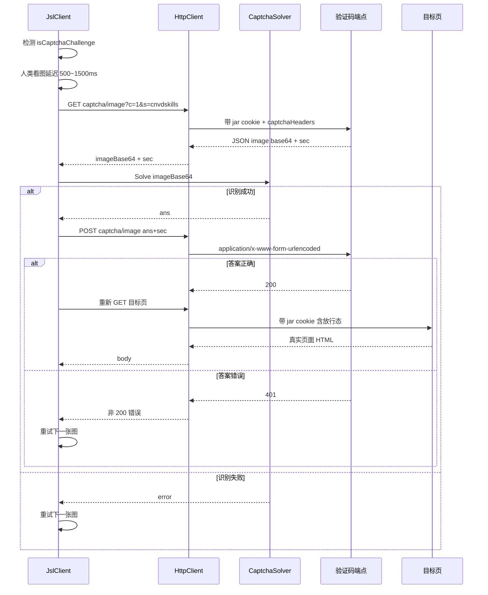
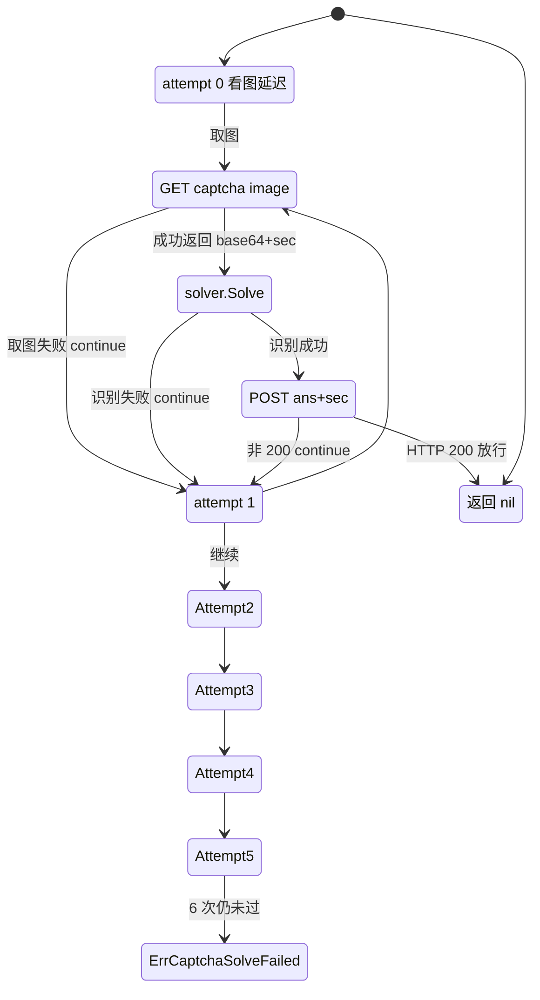

# 验证码挑战

加速乐三层解密通过后，对部分 IP（尤其是代理出口）会再触发**图片验证码挑战**（创宇盾 captcha）。本页说明取图→识别→提交→放行的完整流程与重试状态机。源码位于 [`gojsl/client.go`](https://github.com/scagogogo/cnvd-skills/blob/main/gojsl/client.go) 与 [`gojsl/captcha.go`](https://github.com/scagogogo/cnvd-skills/blob/main/gojsl/captcha.go)。

## 挑战识别

`JslClient.Get` 在第三层（或任意层非预期返回）经 `handlePossibleCaptcha` 检测响应是否为验证码挑战页。识别逻辑简单稳健——只要响应体包含以下任一特征串即判定为挑战页：

```go
func isCaptchaChallenge(body string) bool {
    return strings.Contains(body, "本站开启了验证码保护") ||
        strings.Contains(body, "/cdn-cgi/js/captcha.js")
}
```

判定后分三支：未配置 `solver` 直接返回 `ErrCaptchaRequired`；配置了 `solver` 走 `processCaptcha` 完整流程后重新 GET 拿真实页；非挑战页直接返回原响应。

```go
func (x *JslClient) handlePossibleCaptcha(ctx context.Context, targetUrl, resp string) (string, error) {
    if !isCaptchaChallenge(resp) { return resp, nil }
    if x.solver == nil { return "", ErrCaptchaRequired }
    if err := x.processCaptcha(ctx, targetUrl); err != nil { return "", err }
    return x.plainRequest(ctx, targetUrl)
}
```

## 取图→识别→提交→放行时序

验证码端点为 `https://www.cnvd.org.cn/cdn-cgi/captcha/v2/captcha/image`：GET 取图返回 JSON `{image, sec, msg}`，`image` 为 base64 PNG，`sec` 为会话 token；POST 提交答案时 body 为 `ans=...&sec=...`，端点返回非 200（典型 401）视为答案错误。



验证码请求用 `captchaHeaders`（XHR 头）而非导航头——现代浏览器 fetch 不发 `X-Requested-With`，但 CNVD 的 `captcha.js` 仍检查它，故保留。`Referer` 由调用方按目标 URL 传入，`Sec-Fetch-*` 设为 `same-origin / cors / empty`，对齐浏览器 XHR 行为。

```go
func captchaHeaders(referer string) map[string]string {
    return map[string]string{
        "Accept":           "application/json, text/javascript, */*; q=0.01",
        "X-Requested-With": "XMLHttpRequest",
        "Referer":          referer,
        "Sec-Fetch-Site":   "same-origin",
        "Sec-Fetch-Mode":   "cors",
        "Sec-Fetch-Dest":   "empty",
    }
}
```

## 重试状态机

CNVD 验证码图为中文词组，`ddddocr` 识别有概率性，故 `processCaptcha` 内置最多 6 次重试，每次换一张新图（新 `sec` token）：

```go
func (x *JslClient) processCaptcha(ctx context.Context, targetUrl string) error {
    const maxAttempts = 6
    for attempt := 0; attempt < maxAttempts; attempt++ {
        // ctx 取消检查
        // 人类看图反应延迟 500~1500ms
        reactionDelay := time.Duration(500+globalRand.Intn(1000)) * time.Millisecond
        // 等待 reactionDelay 或 ctx.Done
        imageBase64, sec, err := x.fetchCaptchaImage(ctx, targetUrl)
        if err != nil { continue }
        ans, err := x.solver.Solve(ctx, imageBase64)
        if err != nil { continue }
        if err := x.submitCaptchaAnswer(ctx, targetUrl, ans, sec); err == nil {
            return nil
        }
    }
    return ErrCaptchaSolveFailed
}
```

任一阶段失败（取图失败、识别失败、提交返回非 200）都 `continue` 换图重试，6 次内通过即返回 `nil`，全失败返回 `ErrCaptchaSolveFailed`。重试状态机如下：



注：图中 `Attempt1~5` 复用 `Fetch0/Solve0/Submit0` 同一路径，省略重复绘制。

## 可插拔识别器

识别环节"图→答案"是库的责任边界外，抽成 [`CaptchaSolver` 接口](/api-gojsl/captcha-solver)：

```go
type CaptchaSolver interface {
    Solve(ctx context.Context, imageBase64 string) (string, error)
}
```

内置实现：`NoopCaptchaSolver`（永不识别）、`StaticCaptchaSolver`（固定答案，单测用）、`InteractiveCaptchaSolver`（写盘 + 轮询 `CNVD_CAPTCHA_ANSWER` 环境变量）、`CommandCaptchaSolver`（起子进程，stdin 传 base64 PNG，stdout 读答案）。后者配合仓库自带 `scripts/ddddocr_solver.py`（基于 [ddddocr](https://github.com/sml2h3/ddddocr)）可全自动通过 CNVD 中文词组验证码。

## 错误传播

- `ErrCaptchaRequired`：遇验证码但未配 `solver`，`requestWithRetry` 不重试直接上抛，调用方可用 `errors.Is(err, jsl.ErrCaptchaRequired)` 判断并自行处理。
- `ErrCaptchaSolveFailed`：6 次重试均失败，作为普通错误参与 `MaxRetry` 重试。

详见 [错误处理](/architecture/error-handling)。

## 相关页面

- [加速乐三层解密](/architecture/jsl-three-layers) —— 第三层验证码分支的来源
- [请求全链路](/architecture/request-flow) —— 验证码流程在端到端时序中的位置
- [错误处理](/architecture/error-handling) —— 验证码类错误的传播
- [go-jsl API：CaptchaSolver](/api-gojsl/captcha-solver)
- [go-jsl API：Solver 实现详解](/api-gojsl/solver-implementations)
