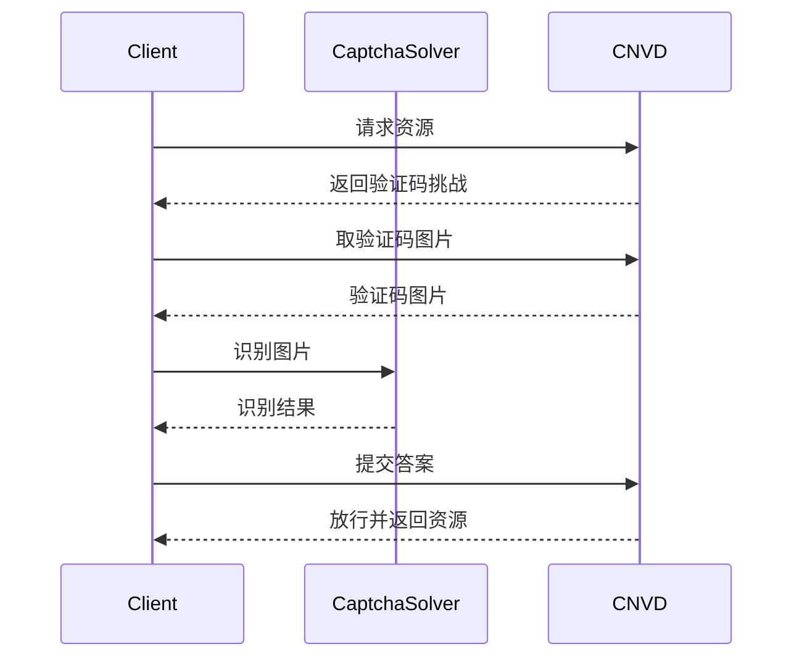

# 验证码挑战

本页说明加速乐验证码挑战的取图、识别、提交、放行流程。

## 挑战时序

命中验证码时，CaptchaSolver 负责识别图片并回填答案，通过后放行后续请求。

```mermaid
sequenceDiagram
    participant Client
    participant CaptchaSolver
    participant CNVD
    Client->>CNVD: 请求资源
    CNVD-->>Client: 返回验证码挑战
    Client->>CNVD: 取验证码图片
    CNVD-->>Client: 验证码图片
    Client->>CaptchaSolver: 识别图片
    CaptchaSolver-->>Client: 识别结果
    Client->>CNVD: 提交答案
    CNVD-->>Client: 放行并返回资源
```

> 本页内容将在后续任务填充。
