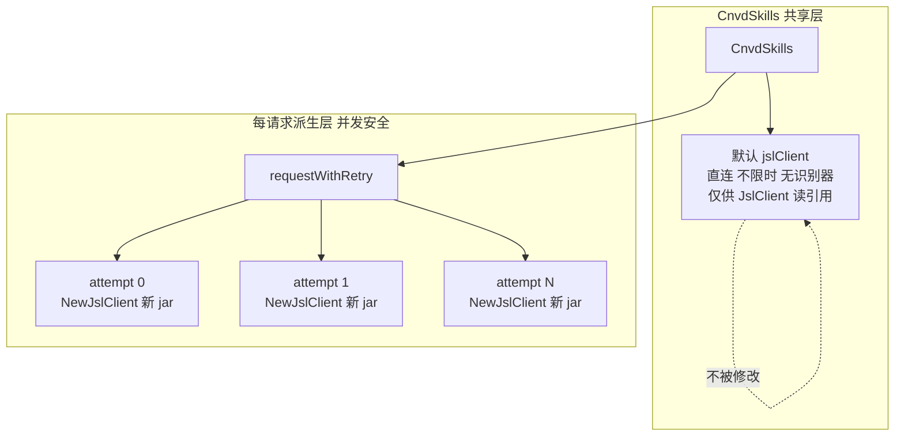
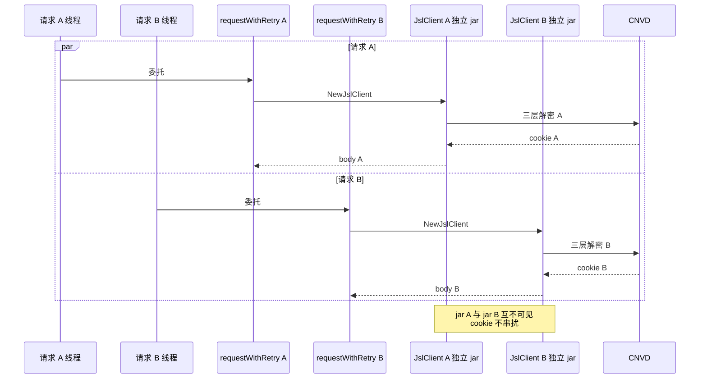

# 并发模型

`CnvdSkills` 持有一个默认 `jsl.JslClient` 实例供串行简单请求使用；带 `Config` 的请求在 `requestWithRetry` 内**每次尝试派生独立 `JslClient`**，不修改共享实例，保证并发安全。本页说明这一模型与 cookie jar 不跨请求共享的原因。源码位于 [`cnvd_skills/cnvd_skills.go`](https://github.com/scagogogo/cnvd-skills/blob/main/cnvd_skills/cnvd_skills.go) 与 [`cnvd_skills/vul_detail.go`](https://github.com/scagogogo/cnvd-skills/blob/main/cnvd_skills/vul_detail.go)。

## 每请求派生独立客户端

`JslClient` 注释明确：一个实例非并发安全（cookie jar 会随请求累积），并发场景请为每个请求构造独立实例。`requestWithRetry` 遵循此约束——每次循环尝试都 `jsl.NewJslClient(proxy, timeoutSec, solver)` 构造全新实例，不在 `CnvdSkills` 持有的默认实例上跑。



`requestWithRetry` 内派生逻辑：

```go
for attempt := 0; attempt <= maxRetry; attempt++ {
    // ctx 取消检查
    client := jsl.NewJslClient(proxy, timeoutSec, solver)
    body, getErr := client.Get(ctx, targetUrl)
    if getErr == nil { return body, nil }
    // 错误分类与重试...
}
```

每次循环新建 `JslClient`，内部 `NewHttpClient` 构造全新 `resty.Client` + 全新 `cookiejar.Jar` + 随机选新 UA（详见 [UA 池与 Client Hints](/architecture/ua-pool)）。并发场景下不同请求的 `JslClient` 互不干扰，cookie 不串扰。

## 默认实例的用途

`CnvdSkills` 持有的默认实例（`jsl.NewJslClient("", 0, nil)`：直连、不限时、不配识别器）通过 `JslClient()` 只读暴露，供外部直接访问任意被加速乐保护的 URL，或供不需要 `Config` 的简单串行调用复用：

```go
type CnvdSkills struct {
    jslClient *jsl.JslClient
}

func NewCnvdSkills() *CnvdSkills {
    return &CnvdSkills{jslClient: jsl.NewJslClient("", 0, nil)}
}

func (x *CnvdSkills) JslClient() *jsl.JslClient {
    return x.jslClient
}
```

注意：默认实例**非并发安全**（cookie jar 会累积 `__jsl_clearance_s`），并发场景不要直接复用，应通过 `*WithConfig` 变体走 `requestWithRetry` 派生路径。

## cookie jar 不跨请求共享

每个派生的 `JslClient` 持有独立 `HttpClient`，后者持有独立 `cookiejar.Jar`。一次请求结束后，该 jar 中的 cookie（三层解密算出的 `__jsl_clearance_s`、验证码放行态等）不会传递到下一次请求。这与"每请求一次新会话"的爬虫模式一致，避免不同请求的会话态串扰。



## 代价与权衡

每请求新建 `JslClient` + `HttpClient` + `resty.Client` 意味着 TCP/TLS 连接不复用跨请求（连接复用仅在一个 `JslClient` 生命周期内的多跳请求间生效，如三层解密的三次 GET + 验证码取图/提交）。这是并发安全与连接复用之间的取舍：

- **收益**：并发安全、cookie 不串扰、每请求独立会话表象（反爬更难关联多请求）。
- **代价**：跨请求不复用 TCP/TLS，每次重新握手。

权衡上倾向于并发安全——CNVD 反爬会话态强相关（`__jsl_clearance_s` 绑定 IP + UA），跨请求复用反而可能因 IP 切换或 UA 轮换导致会话失效。详见 [设计取舍](/architecture/design-decisions)。

## ctx 与并发

`requestWithRetry` 接受 `context.Context` 并透传到 `client.Get` 与内部所有 `time.After` 等待（详见 [错误处理](/architecture/error-handling)），并发场景下可对每个请求设置独立 `ctx` 控制取消/超时，互不影响。

## 相关页面

- [请求全链路](/architecture/request-flow) —— `requestWithRetry` 在端到端时序中的位置
- [cookie 生命周期](/architecture/cookie-lifecycle) —— jar 不跨请求共享
- [隐蔽性强化](/architecture/stealth) —— 连接复用的作用域
- [错误处理](/architecture/error-handling) —— 并发下的 `ctx` 取消传播
- [设计取舍](/architecture/design-decisions) —— 并发安全 vs 连接复用
- [指南：并发安全](/guide/concurrency)
- [cnvd_skills API：CnvdSkills](/api-cnvd-skills/cnvd-skills)
