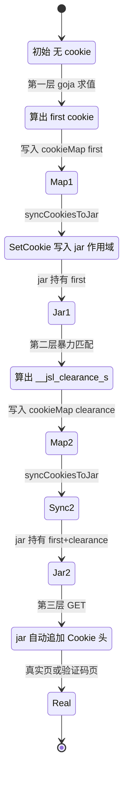
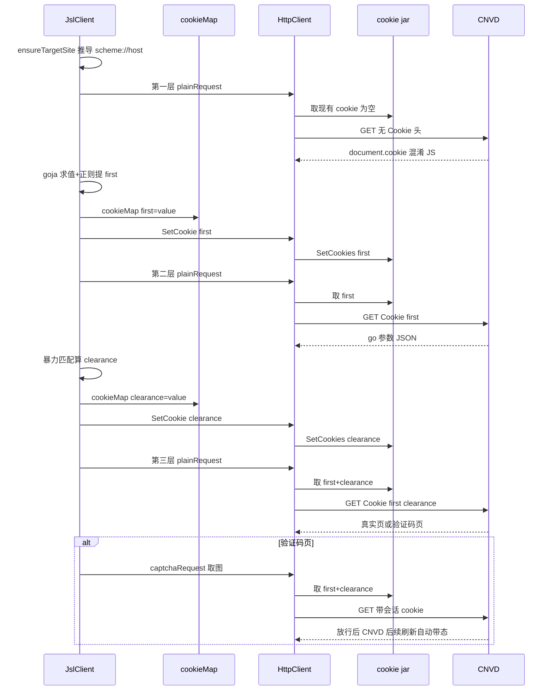

# cookie 生命周期

加速乐三层解密会逐层生成 cookie（第一层初始 cookie、第二层 `__jsl_clearance_s`），这些中间产物先存入 `JslClient.cookieMap`，再经 `syncCookiesToJar` 同步进 `HttpClient` 的 cookie jar，由 jar 在后续请求统一携带 `Cookie` 头。本页说明 cookie 从解密中间产物到 jar 的状态流转。

## 状态图

`cookieMap` 是解密算出的中间产物的暂存区，`targetSite`（`scheme://host`）是写入 jar 的作用域。每次 `processFirstLayer` / `processSecondLayer` 算出新 cookie 后立即 `syncCookiesToJar`，把 `cookieMap` 全量同步进 jar。之后所有请求由 jar 自动追加 `Cookie` 头，无需手动拼接。



`syncCookiesToJar` 实现简单——遍历 `cookieMap` 全量写入 jar：

```go
func (x *JslClient) syncCookiesToJar() {
    if x.targetSite == "" { return }
    for name, value := range x.cookieMap {
        x.httpClient.SetCookie(x.targetSite, name, value)
    }
}
```

`targetSite` 由 `ensureTargetSite` 从首次请求 URL 推导并缓存，避免重复解析：

```go
func (x *JslClient) ensureTargetSite(rawURL string) {
    if x.targetSite != "" { return }
    if u, err := url.Parse(rawURL); err == nil && u.Scheme != "" && u.Host != "" {
        x.targetSite = u.Scheme + "://" + u.Host
    }
}
```

`HttpClient.SetCookie` 把 cookie 写入 jar 对应作用域（`Path: "/"`，`Domain: u.Hostname()`）：

```go
func (h *HttpClient) SetCookie(targetURL, name, value string) {
    u, _ := url.Parse(targetURL)
    h.client.GetClient().Jar.SetCookies(u, []*http.Cookie{
        {Name: name, Value: value, Path: "/", Domain: u.Hostname()},
    })
}
```

## 三层 cookie 累积时序

第一层算出初始 cookie（可能是 `__jsluid_s` 等），第二层算出 `__jsl_clearance_s`，两者都同步进 jar。第三层 GET 时 jar 自动把累积的 cookie 追加到请求头。验证码端点请求也复用同一 jar，故放行后的会话态 cookie 同样自动携带。



## 为何用 jar 而非手动拼头

- **会话一致性**：jar 自动处理 `Set-Cookie` 响应头（如 CNVD 服务端续期 `__jsluid_s`），无需库手动解析响应 cookie。
- **避免遗漏**：三层累积的 cookie 由 jar 统一携带，不会因漏拼某层 cookie 而被加速乐判定为非法会话。
- **贴近浏览器**：浏览器单会话内 cookie 由存储统一管理，jar 行为与此一致，降低反爬识别（详见 [隐蔽性强化](/architecture/stealth)）。
- **作用域隔离**：jar 按 URL 作用域管理 cookie，`targetSite` 仅推导一次缓存复用，避免重复解析 URL。

## 不跨请求共享

一个 `JslClient`（及其 `HttpClient` + jar）对应一个会话，非并发安全——cookie jar 会随请求累积，跨请求共享会导致会话串扰。`requestWithRetry` 每次尝试派生独立 `JslClient`，cookie 不跨请求复用，详见 [并发模型](/architecture/concurrency-model)。

## 调试与兼容

`HttpClient.Cookies(targetURL)` 返回 jar 中某 URL 的所有 cookie，供调试与兼容旧 `cookieMap` 读取场景：

```go
func (h *HttpClient) Cookies(targetURL string) []*http.Cookie {
    u, _ := url.Parse(targetURL)
    return h.client.GetClient().Jar.Cookies(u)
}
```

## 相关页面

- [加速乐三层解密](/architecture/jsl-three-layers) —— 三层各自的 cookie 生成算法
- [隐蔽性强化](/architecture/stealth) —— cookie jar 作为五维之一
- [并发模型](/architecture/concurrency-model) —— jar 不跨请求共享
- [请求全链路](/architecture/request-flow) —— cookie 在端到端时序中的携带
- [go-jsl API：HttpClient](/api-gojsl/http-client)
