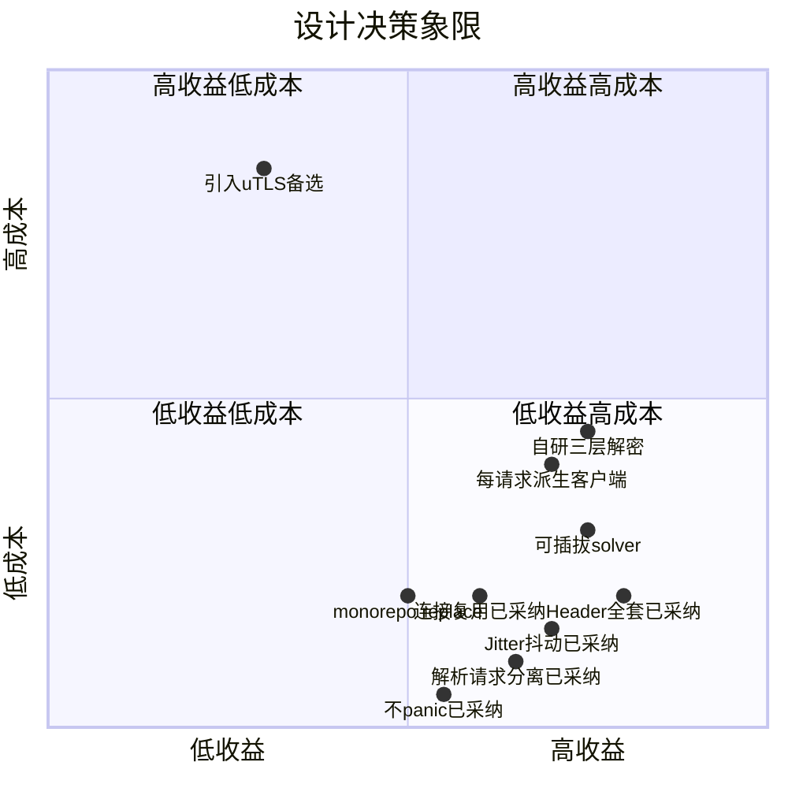
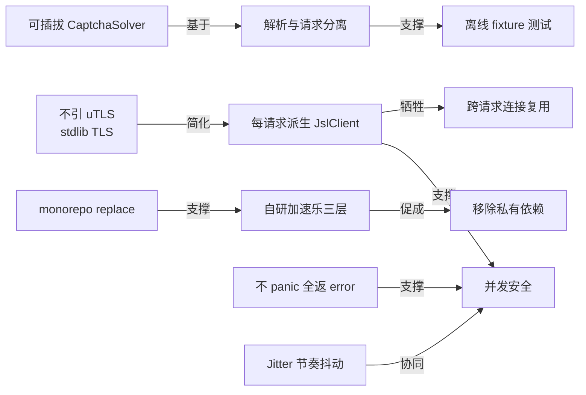

# 设计取舍

本页汇总 cnvd-skills 的关键设计决策与取舍依据：不引 uTLS、可插拔 CaptchaSolver、monorepo replace、自研加速乐三层、并发安全 vs 连接复用、解析与请求分离等。每项决策的"为什么这么做"与"何时不这么做"。

## 决策矩阵

| 决策 | 选择 | 替代 | 依据 | 触发重评估 |
|------|------|------|------|------------|
| TLS 指纹 | 不引 uTLS 用 stdlib | 引 uTLS 模仿 Chrome | 当前无目标站点 TLS 指纹级拦截，依赖/维护成本高 | 出现 JA3/JA4 指纹拦截 |
| 验证码识别 | `CaptchaSolver` 接口可插拔 | 内置 OCR | 识别能力是库边界外，纯 Go 库不背 Python 依赖 | 出现纯 Go 高识别率 OCR |
| 模块组织 | monorepo `replace ./gojsl` | 双仓库独立发布 | 本地开发即改即用 + 保留独立分发 | 子模块需独立版本节奏 |
| 加速乐逆向 | 自研三层解密 | 依赖私有 jsl_sdk | 移除私有依赖（不需 GOPRIVATE）+ 修复 `; Max-age` 兼容 | 私有 SDK 重新可用且更稳定 |
| 并发安全 | 每请求派生 JslClient | 共享单例 + 锁 | cookie jar 会话态绑定 IP/UA，跨请求复用反致失效 | 需极致优化跨请求连接复用 |
| 解析与请求 | `ParseXxx` 接受纯字符串 | 解析绑定请求结果 | 可用本地 fixture 离线测试 | 无 |
| 错误处理 | 不 panic 全返 error | panic 兜底 | 库代码契约 | 无 |
| 节奏控制 | `Jitter` 随机抖动默认 0.3 | 固定间隔 | 模拟人类节奏降低频控识别 | 无 |

## 决策象限

按"收益/成本"两轴把各决策定位到象限：高收益低成本（已采纳）、高收益高成本（可选引入）、低收益低成本（已采纳补充）、低收益高成本（暂不引入）。

"不引 uTLS" 落在高成本象限，当前收益不足以支撑，故暂不引入；其余决策多落在低成本高收益象限，已采纳。

## 取舍关系图

各决策并非独立——"可插拔 solver"依赖"识别与流程分离"，"自研三层"促成"移除私有依赖"，"每请求派生客户端"支撑"并发安全"同时牺牲"跨请求连接复用"。下图展示决策间的支撑/牺牲关系。

## 关键决策详解

### 不引 uTLS

当前隐蔽性聚焦连接/Header/UA/节奏四维，已验证可穿透 CNVD 加速乐三层 + 创宇盾 + 图片验证码。引入 uTLS 边际收益为零（无目标在 TLS 指纹层拦截），却要付出依赖与维护成本（需同步 Chrome HelloSpec 更新）。详见 [TLS 指纹决策](/architecture/tls-fingerprint)。

### 可插拔 CaptchaSolver

识别环节"图→答案"涉及 OCR，最佳实现（如 [ddddocr](https://github.com/sml2h3/ddddocr)）是 Python 生态。把识别抽成接口（`Solve(ctx, imageBase64) (string, error)`），库保持纯 Go，调用方按需注入识别器（`CommandCaptchaSolver` 起子进程调 Python）。库负责取图/提交/放行刷新/重试 6 次。详见 [验证码挑战](/architecture/captcha)。

### monorepo replace

根模块 `require github.com/scagogogo/go-jsl` + `replace => ./gojsl`，本地改 `gojsl` 立即生效无需先发布；同时子模块 `gojsl/go.mod` 声明独立 module，可被外部 `go get github.com/scagogogo/go-jsl` 作为通用加速乐库使用。两者两全。详见 [模块划分](/architecture/modules)。

### 自研加速乐三层

原依赖私有 `github.com/JSREP/go-jsl-sdk` 需配 `GOPRIVATE`。自研三层解密（goja 求值第一层 + md5/sha1/sha256 暴力匹配第二层 + 带 cookie GET 第三层）后移除私有依赖，所有依赖公开可 `go get`。同时修复原 SDK 的 `; Max-age` 大小写兼容问题。详见 [加速乐三层解密](/architecture/jsl-three-layers)。

### 每请求派生 JslClient

`JslClient` 非并发安全（cookie jar 累积）。`requestWithRetry` 每次尝试 `NewJslClient` 派生独立实例，支撑并发安全，但牺牲跨请求 TCP/TLS 连接复用（复用仅在一个 `JslClient` 生命周期内的多跳间生效）。权衡倾向并发安全——CNVD 会话态 `__jsl_clearance_s` 绑定 IP + UA，跨请求复用反而易失效。详见 [并发模型](/architecture/concurrency-model)。

### 解析与请求分离

`ParseVulDetail` / `ParseVulList` / `ParseVulPatch` 接受纯 HTML 字符串入参，返回结构体与 error。可用本地 fixture 离线测试解析逻辑，无需网络与代理。请求侧 `RequestXxx` 内部走 `requestWithRetry` + 对应 `ParseXxx`。详见 [请求全链路](/architecture/request-flow)。

### 不 panic

所有错误返回 error，库代码无 `panic` 调用。`requestWithRetry` 把 `ErrCaptchaRequired` 直接上抛不重试，代理类错误换 IP 重试，普通错误按 `MaxRetry` 重试，超出返回 `lastErr`。详见 [错误处理](/architecture/error-handling)。

### Jitter 节奏抖动

`Config.Jitter`（默认 0.3 = ±30%）随机化翻页/详情/代理重试间隔；验证码取图前加 500~1500ms 人类看图反应延迟。模拟人类浏览节奏降低频控识别。详见 [隐蔽性强化](/architecture/stealth)。

## 其他取舍

- **代理内置实现最小化**：仅内置 `FixedProxyProvider`（固定 IP）与 `PinYiProxyProvider`（品易 API，源已下线仅供兼容）。不内置更多代理源——`ProxyProvider` 是 `func() (string, error)` 单方法接口，调用方按需实现即可，库不应背具体代理 API 的依赖与失效责任。
- **重定向策略选 `FlexibleRedirectPolicy(10)`**：允许最多 10 次重定向，对齐浏览器；加速乐三层依赖 JS 跳转而非 HTTP 302，但保留以兼容普通页与代理透传场景。
- **`Accept-Encoding: gzip, deflate` 而非 `br`**：Go 标准库 `net/http` 透明解压 gzip/deflate，但不支持 Brotli；声明 `br` 却不处理会被识别为伪造。故仅声明 stdlib 能解压的编码。
- **第二层判定宽松不硬编码 `wt`**：原 `jsl_sdk` 硬编码 `wt` 值，加速乐调整即失效。本库 `isSecondLayer` 只校验 `tn/ct` 字段与 `})</script>` 结尾，`processSecondLayer` 用解析出的 `wt` 而非硬编码 1500ms 做休眠，抵抗 `wt/vt` 调整。

## 相关页面

- [总览](/architecture/overview) —— 整体架构
- [模块划分](/architecture/modules) —— monorepo replace
- [TLS 指纹决策](/architecture/tls-fingerprint) —— 不引 uTLS
- [验证码挑战](/architecture/captcha) —— 可插拔 solver
- [并发模型](/architecture/concurrency-model) —— 每请求派生客户端
- [错误处理](/architecture/error-handling) —— 不 panic 全返 error
- [隐蔽性强化](/architecture/stealth) —— Jitter 节奏抖动
- [加速乐三层解密](/architecture/jsl-three-layers) —— 自研三层
