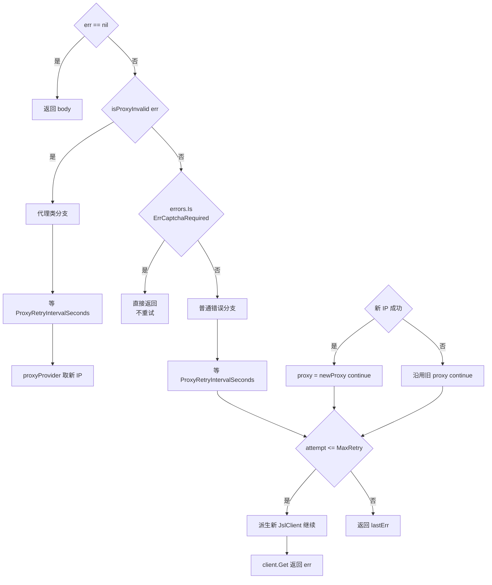
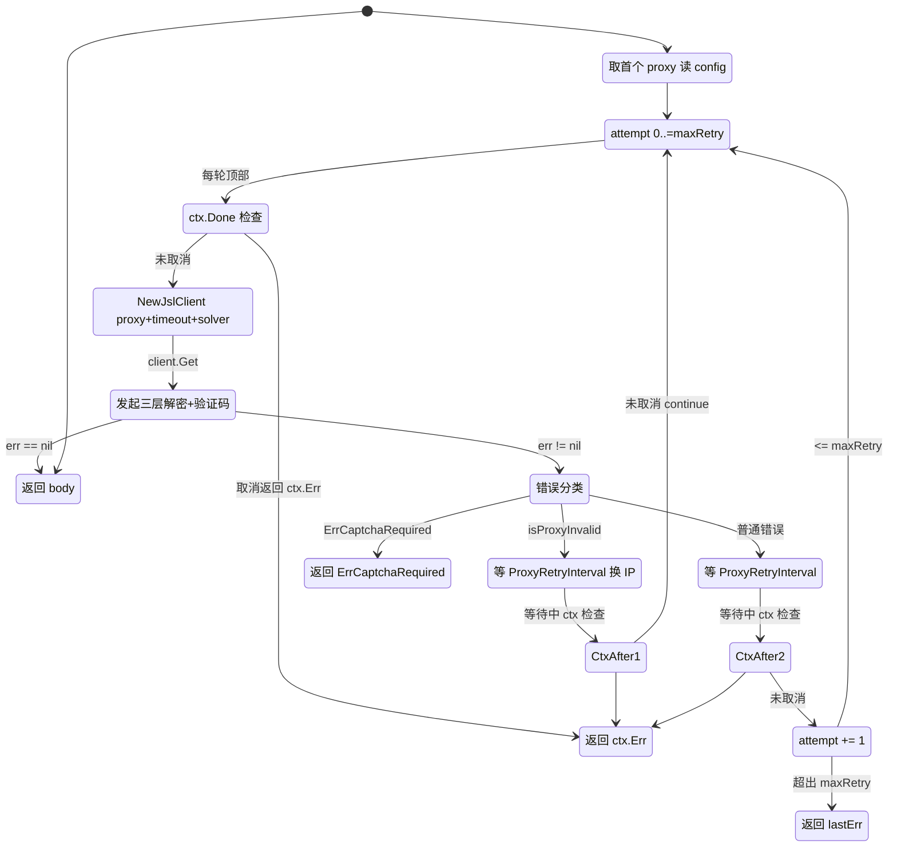

# 错误处理

`requestWithRetry` 是 `CnvdSkills` 上所有带 `Config` 请求的统一收口，按错误类型分流：代理类错误换 IP 重试、验证码类错误直接上抛、其余普通错误按 `MaxRetry` 重试。库代码无 `panic`，所有错误返回 `error`。源码位于 [`cnvd_skills/vul_detail.go`](https://github.com/scagogogo/cnvd-skills/blob/main/cnvd_skills/vul_detail.go) 与 [`cnvd_skills/proxy.go`](https://github.com/scagogogo/cnvd-skills/blob/main/cnvd_skills/proxy.go)。

## 错误分类决策树

`client.Get` 返回的错误经三层判定分流：`nil` 成功返回；`isProxyInvalid` 判定为代理类（换 IP 重试）；`errors.Is(ErrCaptchaRequired)` 判定为验证码类（不重试直接上抛）；其余为普通错误（按 `MaxRetry` 重试）。



## 代理错误判定

`isProxyInvalid` 用错误信息字符串匹配判定代理类错误，覆盖 TCP 读错误、EOF、代理连接拒绝、`context` 超时/取消等场景：

```go
func isProxyInvalid(err error) bool {
    if err == nil { return false }
    msg := err.Error()
    switch {
    case strings.HasPrefix(msg, "read tcp "):          return true
    case strings.HasSuffix(msg, "unexpected EOF"):     return true
    case strings.Contains(msg, "proxyconnect"):        return true
    case strings.Contains(msg, "EOF"):                 return true
    case strings.Contains(msg, "connection refused"):  return true
    case strings.Contains(msg, "i/o timeout"):         return true
    case strings.Contains(msg, "context deadline exceeded"): return true
    }
    return false
}
```

判定为代理类时，`requestWithRetry` 等 `ProxyRetryIntervalSeconds`（默认 3 秒）后重新向 `proxyProvider` 取新 IP，沿用新 IP `continue` 重试（新 IP 取失败则沿用旧 proxy）。

## 验证码类错误

`ErrCaptchaRequired` 表示遇验证码但未配 `solver`，重试无用（同一 IP 仍会触发验证码且仍无识别器），`requestWithRetry` 直接上抛，调用方可用 `errors.Is` 判断并自行处理（如配置识别器后重试）：

```go
if errors.Is(getErr, jsl.ErrCaptchaRequired) {
    return "", getErr
}
```

`ErrCaptchaSolveFailed`（6 次重试后仍失败）作为普通错误处理，参与 `MaxRetry` 重试。

## requestWithRetry 重试状态机

重试循环上限由 `config.MaxRetry` 决定（`attempt := 0; attempt <= maxRetry`），即默认 `MaxRetry=3` 时最多跑 4 轮（初始 + 3 次重试）。`config == nil` 时 `maxRetry=0`，循环只跑一次，退化为单次请求。每轮循环顶部与所有 `time.After` 等待处都检查 `ctx.Done()`，保证取消即时生效。



## ctx 取消传播

`requestWithRetry` 把 `ctx` 透传给 `client.Get`，后者进一步透传到 `HttpClient.Do` / `DoStatus` / `DoPostStatus` 的 `resty.R().SetContext(ctx)`，飞行中的 HTTP 请求随 `ctx` 取消而中断。三层解密与验证码流程内部的所有 `time.After` 等待都配套 `select` 监听 `ctx.Done()`，详见 [加速乐三层解密](/architecture/jsl-three-layers) 的 `wt` 休眠与 [验证码挑战](/architecture/captcha) 的看图延迟。

## 错误传播到调用方

| 错误 | 来源 | requestWithRetry 行为 | 调用方判断 |
|------|------|------------------------|-------------|
| `nil` | 解密成功 | 返回 body | 正常 |
| 代理类 | TCP/EOF/超时 | 换 IP 重试 | 超出 `MaxRetry` 返回 `lastErr` |
| `ErrCaptchaRequired` | 验证码未配 solver | 不重试直接上抛 | `errors.Is(err, jsl.ErrCaptchaRequired)` |
| `ErrCaptchaSolveFailed` | 6 次识别失败 | 按 `MaxRetry` 重试 | `errors.Is(err, jsl.ErrCaptchaSolveFailed)` |
| 创宇盾拦截 | `当前访问疑似黑客攻击` | 按 `MaxRetry` 重试 | 视为普通错误 |
| `ctx.Err()` | 取消 | 立即返回 | `errors.Is(err, context.Canceled)` |

## 相关页面

- [请求全链路](/architecture/request-flow) —— 错误在端到端时序中的位置
- [加速乐三层解密](/architecture/jsl-three-layers) —— 创宇盾拦截
- [验证码挑战](/architecture/captcha) —— `ErrCaptchaRequired` / `ErrCaptchaSolveFailed`
- [并发模型](/architecture/concurrency-model) —— 每请求派生独立客户端
- [go-jsl API：错误变量](/api-gojsl/errors)
