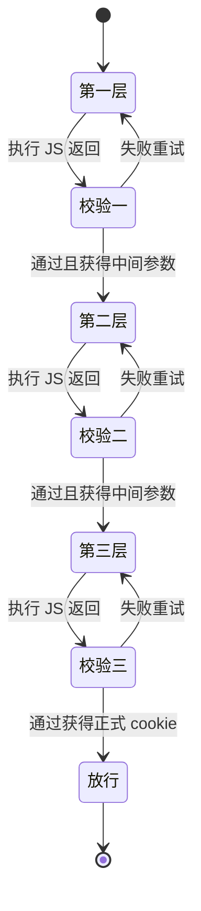

# 加速乐三层解密

本页说明加速乐 anti-crawler 的三层解密机制及其状态流转。

## 三层状态机

请求命中加速乐后，依次穿越三层 JS 校验，逐层生成后续所需的 cookie 与参数。

```mermaid
stateDiagram-v2
    [*] --> 第一层
    第一层 --> 校验一: 执行 JS 返回
    校验一 --> 第二层: 通过且获得中间参数
    校验一 --> 第一层: 失败重试
    第二层 --> 校验二: 执行 JS 返回
    校验二 --> 第三层: 通过且获得中间参数
    校验二 --> 第二层: 失败重试
    第三层 --> 校验三: 执行 JS 返回
    校验三 --> 放行: 通过获得正式 cookie
    校验三 --> 第三层: 失败重试
    放行 --> [*]
```

> 本页内容将在后续任务填充。
