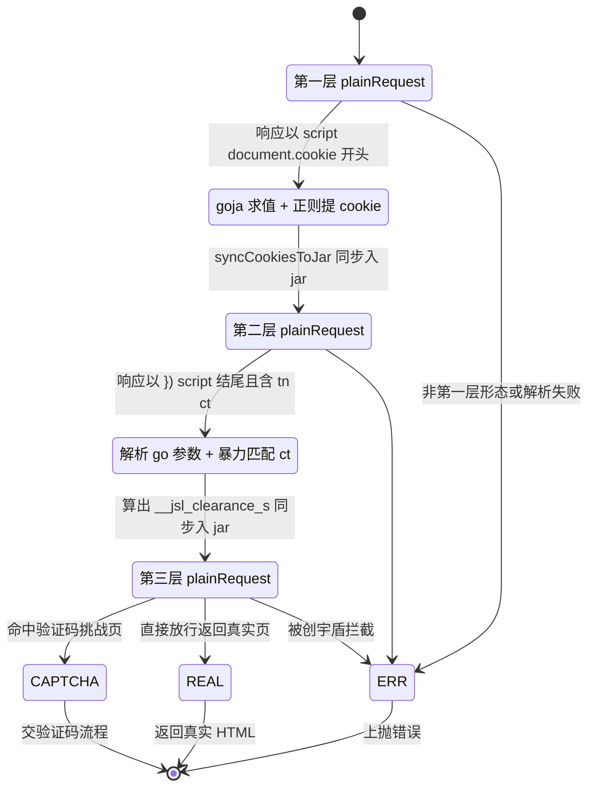
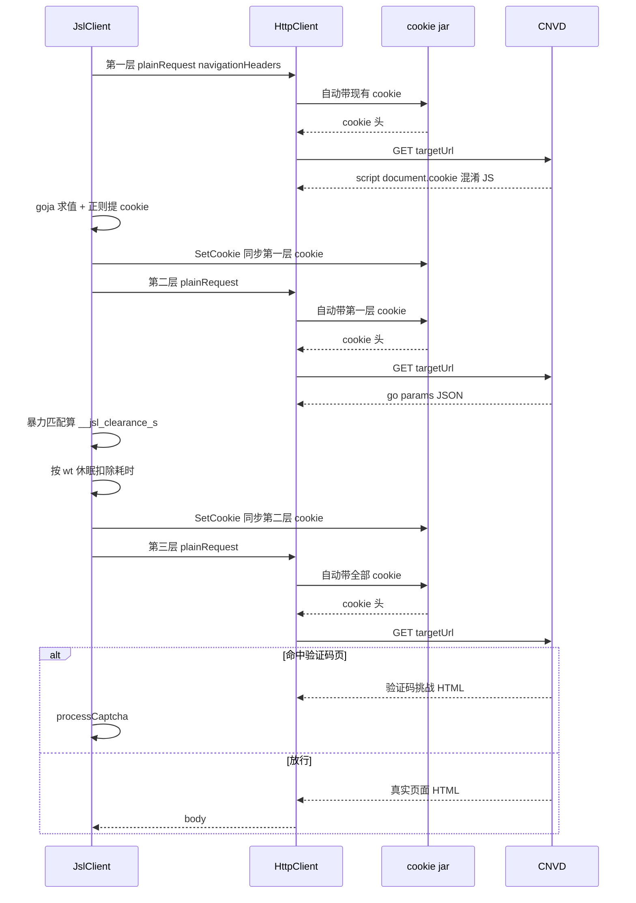

# 加速乐三层解密

CNVD 由[加速乐（JSL）](https://www.yunaq.com/)反爬保护，访问任意 URL 都需穿越三层 JS 校验。本页说明三层解密的状态机、每层的算法细节与时序。源码位于 [`gojsl/client.go`](https://github.com/scagogogo/cnvd-skills/blob/main/gojsl/client.go)。

## 三层状态机

`JslClient.Get` 用三次 `plainRequest` 串行穿越三层。第一层返回 `document.cookie=XXX` 混淆 JS，第二层返回 `go({...})` 参数 JSON，第三层用算出的 cookie 命中真实页（或验证码挑战页）。每一层失败或返回非预期形态都会上抛错误，由上层 `requestWithRetry` 决定是否重试。



判定函数（与源码一致）：

```go
func (x *JslClient) isFirstLayer(body string) bool {
    return strings.HasPrefix(body, "<script>document.cookie=") &&
        strings.HasSuffix(body, ";location.href=location.pathname+location.search</script>")
}

func (x *JslClient) isSecondLayer(body string) bool {
    return strings.HasSuffix(body, "})</script>") &&
        strings.Contains(body, `"tn":"__jsl_clearance`) &&
        strings.Contains(body, `"ct":"`)
}
```

第二层判定宽松不硬编码 `wt`，可抵抗加速乐调整 `wt/vt` 参数。

## 第一层：document.cookie 混淆 JS

第一层响应是 `document.cookie=XXX;location.href=...` 形态的混淆 JS。`processFirstLayer` 用 [goja](https://github.com/dop251/goja) 求值 `document.cookie=XXX` 部分得到形如 `name=value;Max-age=3600` 的字符串，再用兼容正则提取 `name` 与 `value`：

```go
find := regexp.MustCompile(`document\.cookie=([\s\S]+?)location\.href=`).FindStringSubmatch(responseBody)
v, err := goja.New().RunString(find[1])
setCookieStr, _ := v.Export().(string)
submatch := regexp.MustCompile(`(.+?)=(.+?);\s*[Mm]ax-[Aa]ge`).FindStringSubmatch(setCookieStr)
x.cookieMap[submatch[1]] = submatch[2]
x.syncCookiesToJar()
```

兼容正则覆盖 `;max-age` / `; Max-age` / `; Max-Age` 等大小写与空格组合——这是相对原 `jsl_sdk` 修复的关键点（原正则不兼容 `; Max-age` 大写带空格，会漏提取）。提取后写入 `cookieMap` 并同步进 jar，由 jar 在后续请求自动携带。

## 第二层：go 参数暴力匹配

第二层响应包含 `go({...})` 形态的调用，参数为 JSON：

```go
type secondLayerParams struct {
    Bts   []string `json:"bts"`
    Chars string   `json:"chars"`
    Ct    string   `json:"ct"`
    Ha    string   `json:"ha"`
    Tn    string   `json:"tn"`
    Vt    string   `json:"vt"`
    Wt    string   `json:"wt"`
}
```

`newCookie` 复刻原 `jsl_sdk` 的纯 Go 破解算法：遍历 `Chars` 的二维字符对 `c1, c2`，拼成 `Bts[0] + c1 + c2 + Bts[1]`，按 `Ha` 指定的算法（`md5` / `sha1` / `sha256`）求哈希，与 `Ct` 比较，匹配则返回该拼接串作为 `__jsl_clearance_s` 的值：

```go
for _, c1 := range params.Chars {
    for _, c2 := range params.Chars {
        v := params.Bts[0] + string(c1) + string(c2) + params.Bts[1]
        var result string
        switch params.Ha {
        case "md5":    result = hex.EncodeToString(md5.New().Sum([]byte(v)))
        case "sha1":   result = fmt.Sprintf("%x", sha1.New().Sum([]byte(v)))
        case "sha256": result = fmt.Sprintf("%x", sha256.New().Sum([]byte(v)))
        }
        if result == params.Ct { return v, time.Since(begin).Milliseconds() }
    }
}
```

随后按解析出的 `wt`（而非硬编码 1500ms）做休眠以模拟原 JS 中的 `setTimeout` 延时，扣除 `newCookie` 已耗时 `cost`，剩余时间 `time.After` 等待，期间响应 `ctx.Done()` 立即取消。完成后写入 `cookieMap[params.Tn]`（即 `__jsl_clearance_s`）并同步进 jar。

## 第三层：带 cookie GET

第三层用累积的 cookie（第一层 + 第二层）发起 GET。若加速乐认可，直接返回真实页面 HTML；若 IP 被风控，可能返回验证码挑战页（交 [验证码挑战](/architecture/captcha) 流程），或被创宇盾拦截返回 `当前访问疑似黑客攻击，已被创宇盾拦截。`——`plainRequest` 检测到后者时上抛 `blocked by 创宇盾 (proxy may be banned)`，由 [错误处理](/architecture/error-handling) 决定换 IP 重试。

## 每层时序

下面是三层解密 + 第三层验证码分支的时序。每一跳都经统一 `HttpClient`，cookie 由 jar 自动携带，无需手动拼 `Cookie` 头。



## cookie 同步策略

解密算出的中间 cookie 不直接拼到请求头，而是经 `syncCookiesToJar` 写入 jar 的作用域（由 `ensureTargetSite` 从首次请求 URL 推导 `scheme://host`），后续请求由 jar 统一携带。这样三层累积的 cookie 在同一 `JslClient` 实例内自动复用，且与浏览器单会话行为一致。详见 [cookie 生命周期](/architecture/cookie-lifecycle)。

## 相关页面

- [cookie 生命周期](/architecture/cookie-lifecycle) —— `cookieMap` 与 jar 的同步
- [请求全链路](/architecture/request-flow) —— 三层在端到端时序中的位置
- [验证码挑战](/architecture/captcha) —— 第三层验证码分支
- [go-jsl API：三层解密深度解析](/api-gojsl/three-layers-deep-dive)
