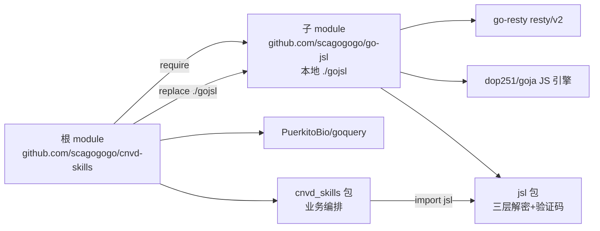
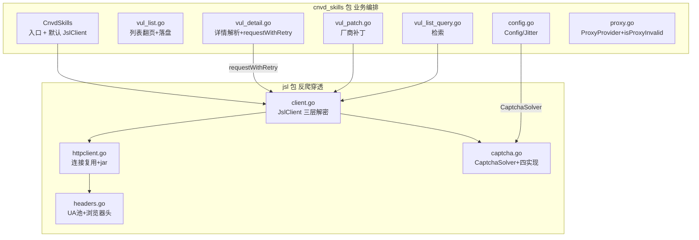

# 模块划分

cnvd-skills 采用 monorepo 双模块结构：根模块 `github.com/scagogogo/cnvd-skills`（业务编排 `cnvd_skills` 包）通过 `go.mod` 的 `require` + 本地 `replace` 依赖子目录 `./gojsl` 暴露的 `github.com/scagogogo/go-jsl`（`jsl` 包）。两者均为公开模块，无需 `GOPRIVATE`。

## 依赖关系

根模块声明 `require github.com/scagogogo/go-jsl`，再用 `replace` 指向本地子目录，便于本地开发与一体化发布；调用方亦可独立 `go get github.com/scagogogo/go-jsl` 把加速乐逆向作为通用库使用。



`go.mod` 关键片段：

```go
module github.com/scagogogo/cnvd-skills

require (
    github.com/PuerkitoBio/goquery v1.8.1
    github.com/scagogogo/go-jsl v0.0.0-00010101000000-000000000000
)

replace github.com/scagogogo/go-jsl => ./gojsl
```

子模块 `gojsl/go.mod` 声明 `module github.com/scagogogo/go-jsl`，依赖 `go-resty` 与 `goja`，无私有依赖。

## 包职责划分

`cnvd_skills` 包负责业务编排（页面/接口的语义解析、翻页、落盘、去重、检索），`jsl` 包负责反爬穿透（三层解密 + 验证码挑战 + HTTP 收发 + 隐蔽性）。两者通过 `jsl.JslClient` 与 `jsl.CaptchaSolver` 两个类型耦合，其余完全解耦。



### cnvd_skills 包文件职责

| 文件 | 职责 |
|------|------|
| `cnvd_skills.go` | `CnvdSkills` 入口，持有默认 `jslClient` |
| `config.go` | `Config` 配置 + `DefaultConfig` |
| `vul_detail.go` | 漏洞详情请求/解析 + `requestWithRetry` |
| `vul_list.go` | 漏洞列表翻页主流程 + 落盘去重 |
| `vul_list_query.go` | 按关键词/日期/厂商/级别检索 |
| `vul_patch.go` | 厂商补丁请求/解析 |
| `proxy.go` | `ProxyProvider` 接口 + 内置实现 + `isProxyInvalid` |

### jsl 包文件职责

| 文件 | 职责 |
|------|------|
| `client.go` | `JslClient` 三层解密 + 验证码挑战编排 |
| `httpclient.go` | `HttpClient` 连接复用 + cookie jar + UA 池 |
| `headers.go` | `userAgent` 结构 + UA 池 + 导航/XHR 头 |
| `captcha.go` | `CaptchaSolver` 接口 + 四种内置实现 |

## 跨包耦合点

`cnvd_skills` 包仅引用 `jsl` 包的两个导出类型：

- `jsl.JslClient` —— `CnvdSkills` 持有一个默认实例（直连、不限时、不配识别器），并通过 `requestWithRetry` 按请求派生独立实例（详见 [并发模型](/architecture/concurrency-model)）。
- `jsl.CaptchaSolver` —— `Config.CaptchaSolver` 字段类型，由调用方注入识别器实现（详见 [验证码挑战](/architecture/captcha)）。

`jsl` 包不反向依赖 `cnvd_skills`，可独立 `go get` 使用：

```go
import "github.com/scagogogo/go-jsl"
client := jsl.NewJslClient("", 30, jsl.CommandCaptchaSolver{...})
```

## 设计动机

- **monorepo replace**：本地开发改 `gojsl` 立即生效，无需先发布再 `go get` 升级；同时保留 `go get github.com/scagogogo/go-jsl` 的独立分发能力。详见 [设计取舍](/architecture/design-decisions)。
- **解析与请求分离**：`ParseXxx` 接受纯 HTML 字符串入参，可用本地 fixture 离线测试，无需网络与代理。
- **不 panic**：所有错误返回 `error`，库代码无 `panic` 调用。

## 相关页面

- [总览](/architecture/overview) —— 整体架构
- [请求全链路](/architecture/request-flow) —— `requestWithRetry` 在业务与解密层之间的位置
- [并发模型](/architecture/concurrency-model) —— 默认实例与派生实例的关系
- [设计取舍](/architecture/design-decisions) —— monorepo replace 的决策
- [cnvd_skills API：CnvdSkills](/api-cnvd-skills/cnvd-skills)
- [go-jsl API：JslClient](/api-gojsl/jsl-client)
