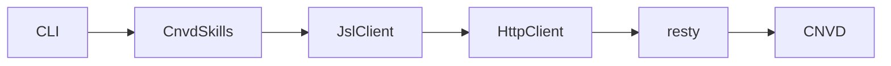
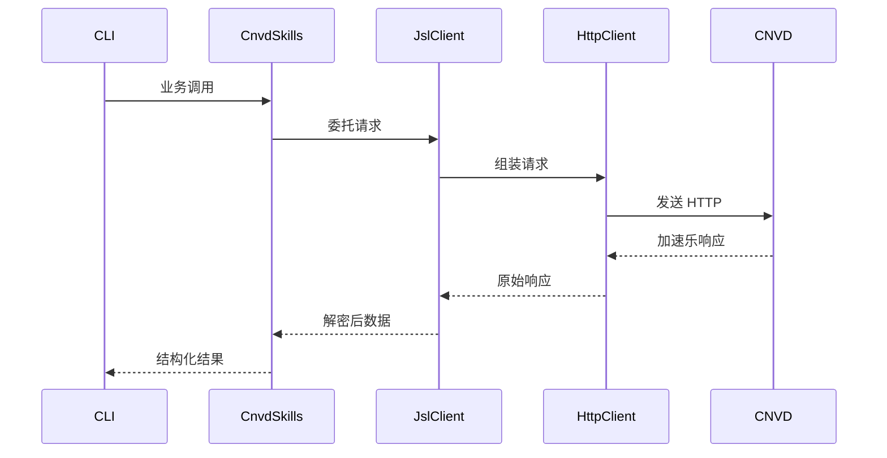

# 架构总览

本页给出 cnvd-skills 的整体模块关系与请求端到端时序。

## 模块关系

CLI 通过 CnvdSkills 编排业务，CnvdSkills 持有默认 JslClient，JslClient 内部组合 HttpClient 与 resty，最终访问 CNVD。

## 请求端到端时序

一次完整请求从 CLI 入口到 CNVD 响应的全过程。

> 本页内容将在后续任务填充。
