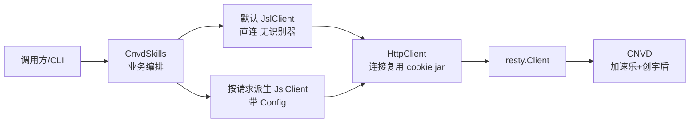
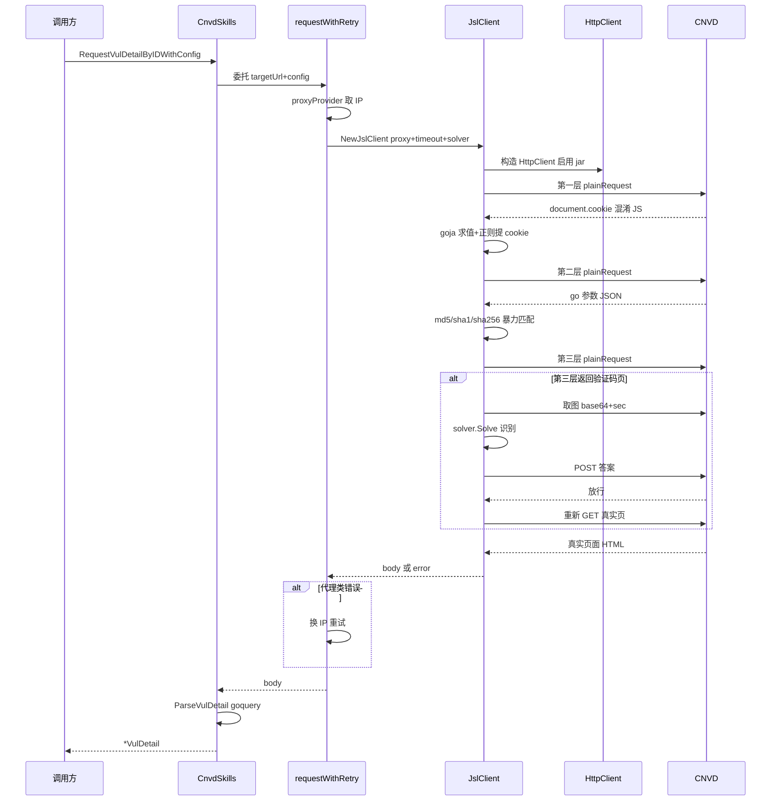

# 架构总览

cnvd-skills 是一个对 [CNVD（国家信息安全漏洞共享平台）](https://www.cnvd.org.cn) 进行页面与接口抓取的 Go 库，自上而下分为四层：业务编排层（`cnvd_skills`）、加速乐解密层（`gojsl`）、HTTP 收发层（`HttpClient` + resty）、目标站点（CNVD）。本页给出整体模块关系与请求端到端时序，子主题详见左侧目录其余各页。

## 模块关系

CLI / 调用方通过 `CnvdSkills` 编排业务（漏洞列表、详情、补丁、检索），`CnvdSkills` 持有一个默认 `jsl.JslClient` 实例供无 `Config` 的简单请求使用；带 `Config` 的请求在 `requestWithRetry` 内按请求派生独立 `JslClient`（并发安全）。`JslClient` 内部组合一个长生命周期的 `HttpClient`，后者基于 `resty` 收发所有 HTTP，最终访问 CNVD。

关键约束：一个 `JslClient` 实例非并发安全（cookie jar 会随请求累积 `__jsl_clearance_s`），并发场景必须为每个请求派生独立实例。共享的默认实例仅用于串行的简单调用，详见 [并发模型](/architecture/concurrency-model)。

## 分层职责

| 层 | 包/文件 | 职责 |
|----|---------|------|
| 业务编排 | `cnvd_skills` | 翻页、详情、补丁、检索、落盘、去重、`requestWithRetry` |
| 解密与挑战 | `gojsl` (`jsl`) | 三层解密 + 验证码挑战 + `CaptchaSolver` 接口 |
| HTTP 收发 | `gojsl/HttpClient` | 连接复用、cookie jar、浏览器级 Header、UA 池 |
| 底层 HTTP | `resty` | 实际请求/响应、重定向、代理、超时 |
| 目标 | CNVD | 加速乐三层 + 创宇盾 + 图片验证码 |

模块边界由 [模块划分](/architecture/modules) 详述，三层解密与验证码详见 [加速乐三层解密](/architecture/jsl-three-layers) 与 [验证码挑战](/architecture/captcha)。

## 请求端到端时序

一次带 `Config` 的请求从 CLI 入口到 CNVD 响应、再回结构化结果的全过程。其中 `requestWithRetry` 负责重试与代理切换（详见 [请求全链路](/architecture/request-flow) 与 [错误处理](/architecture/error-handling)），`JslClient.Get` 内部串行穿越三层解密（详见 [加速乐三层解密](/architecture/jsl-three-layers)），第三层若返回验证码挑战页则进入 [验证码挑战](/architecture/captcha) 流程。

## 跨层关注点

- **隐蔽性**：`HttpClient` 持有长生命周期 resty client，复用 TCP/TLS 连接，cookie jar 自动管理会话，浏览器级 Header 全套，UA 从真实 Chrome 池随机，详见 [隐蔽性强化](/architecture/stealth)。
- **cookie 流转**：三层解密算出的中间 cookie 先存 `cookieMap`，再经 `syncCookiesToJar` 同步进 jar，由 jar 统一携带，详见 [cookie 生命周期](/architecture/cookie-lifecycle)。
- **TLS 指纹**：当前隐蔽性聚焦连接复用/Header/UA/节奏四维，底层用 Go 标准库 `net/http` 的 TLS ClientHello，未引入 uTLS，详见 [TLS 指纹决策](/architecture/tls-fingerprint)。
- **可插拔识别器**：`CaptchaSolver` 把"图→答案"留给调用方注入，库负责取图/提交/放行/重试，详见 [验证码挑战](/architecture/captcha)。

## 相关页面

- [模块划分](/architecture/modules) —— `cnvd_skills` 与 `gojsl` 的依赖与包职责
- [请求全链路](/architecture/request-flow) —— 端到端时序与错误分支
- [加速乐三层解密](/architecture/jsl-three-layers) —— 三层状态机
- [验证码挑战](/architecture/captcha) —— 取图→识别→提交→放行
- [隐蔽性强化](/architecture/stealth) —— 五维协同
- [并发模型](/architecture/concurrency-model) —— 每请求派生独立客户端
- [设计取舍](/architecture/design-decisions) —— 关键决策矩阵
