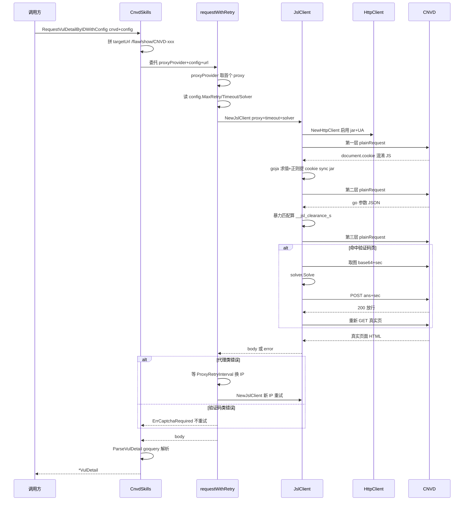
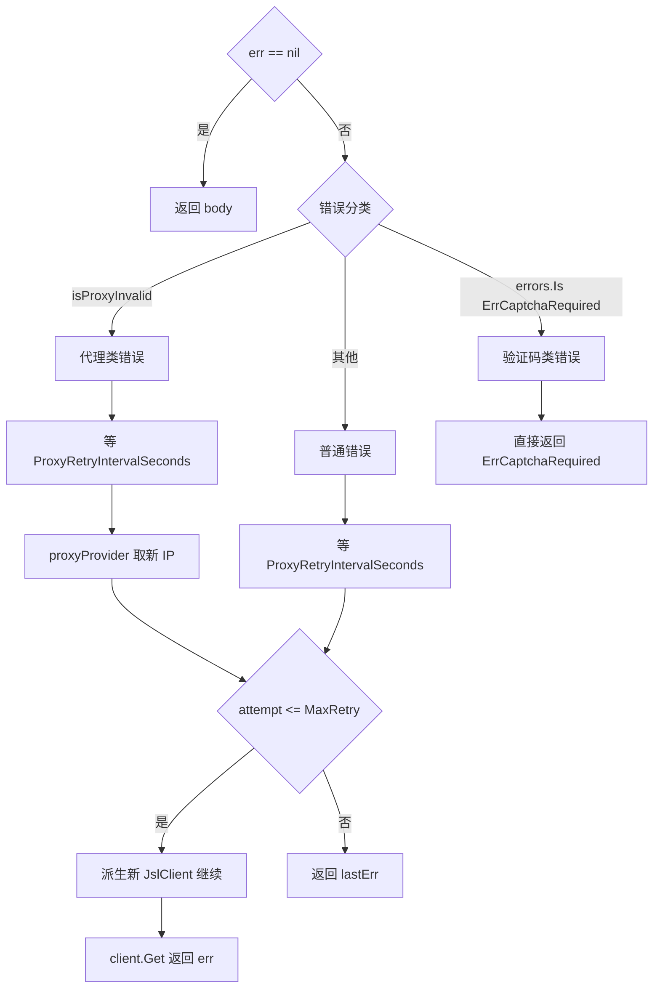

# 请求全链路

本页串起 [模块划分](/architecture/modules) 与各子主题，给出一次带 `Config` 的请求从 CLI 入口到结构化结果的端到端时序，以及错误分支流程。核心入口是 `cnvd_skills/vul_detail.go` 的 `requestWithRetry`。

## 端到端时序

以 `RequestVulDetailByIDWithConfig` 为例（列表、补丁、检索路径相同，仅解析函数不同）：CLI 调用 → `CnvdSkills` 委托 → `requestWithRetry` 取代理 + 派生 `JslClient` → `JslClient.Get` 穿越三层解密 → 第三层若验证码则进挑战流程 → 返回 body → `ParseVulDetail` 用 goquery 解析 → 返回 `*VulDetail`。



## requestWithRetry 核心逻辑

`requestWithRetry` 是 `CnvdSkills` 上所有带 `Config` 请求的统一收口，封装重试、代理切换、验证码错误处理与 `ctx` 取消：

```go
func (x *CnvdSkills) requestWithRetry(ctx context.Context, proxyProvider ProxyProvider,
    config *Config, targetUrl string) (string, error) {
    proxy, err := proxyProvider()
    if err != nil { return "", err }
    maxRetry, timeoutSec := 0, 0
    var solver jsl.CaptchaSolver
    if config != nil {
        maxRetry = config.MaxRetry
        timeoutSec = config.RequestTimeoutSeconds
        solver = config.CaptchaSolver
    }
    for attempt := 0; attempt <= maxRetry; attempt++ {
        // ctx 取消检查
        client := jsl.NewJslClient(proxy, timeoutSec, solver)
        body, getErr := client.Get(ctx, targetUrl)
        if getErr == nil { return body, nil }
        if isProxyInvalid(getErr) {
            // 等 ProxyRetryIntervalSeconds，换 IP，continue
        }
        if errors.Is(getErr, jsl.ErrCaptchaRequired) {
            return "", getErr // 验证码类不重试直接上抛
        }
        // 普通错误等 ProxyRetryIntervalSeconds 后重试
    }
    return "", lastErr
}
```

关键点：

- **每次尝试派生独立 `JslClient`**：不修改 `CnvdSkills` 持有的共享实例，保证并发安全（详见 [并发模型](/architecture/concurrency-model)）。
- **代理错误换 IP**：`isProxyInvalid` 判定为代理错误时重新向 `proxyProvider` 取新 IP 重试，不消耗 `MaxRetry` 配额外的额外限制（在循环内 `continue`）。
- **验证码类不重试**：`ErrCaptchaRequired` 表示需要调用方配识别器，重试无用，直接上抛。
- **`config == nil` 退化为单次**：`maxRetry=0` 时循环只跑一次，无重试。

## 错误分支流程

`client.Get` 返回的错误按类型分流：代理类换 IP 重试、验证码类直接上抛、其余普通错误按 `MaxRetry` 重试。`ctx.Done()` 在每轮循环顶部与所有 `time.After` 等待处分两处检查，保证取消即时生效。



错误分类细节详见 [错误处理](/architecture/error-handling)，代理实现与 `isProxyInvalid` 判定详见该页。

## 解析阶段

请求成功拿到 body 后，进入与网络完全解耦的解析阶段。`ParseVulDetail` 用 [goquery](https://github.com/PuerkitoBio/goquery) 解析 `.gg_detail tr` 表格行，按 `key` 字段（CNVD-ID / CVE ID / 公开日期 / 危害级别 / 影响产品 / 漏洞描述 / 厂商补丁 等）填充 `VulDetail` 结构。时间字段同时提供字符串与 `*time.Time`（`parseCnvdDate` 依次尝试 4 种 layout）。解析接受纯字符串入参，可用本地 fixture 离线测试。

## 节奏控制

主流程 `VulList` 在翻页与详情请求之间插入 `ListPageIntervalSeconds` / `DetailIntervalSeconds` 间隔，并按 `Jitter` 随机抖动（默认 0.3 = ±30%），模拟人类浏览节奏。验证码取图前还有 500~1500ms 看图反应延迟。详见 [隐蔽性强化](/architecture/stealth)。

## 相关页面

- [总览](/architecture/overview) —— 整体架构与端到端时序
- [加速乐三层解密](/architecture/jsl-three-layers) —— 三层细节
- [验证码挑战](/architecture/captcha) —— 第三层验证码分支
- [错误处理](/architecture/error-handling) —— 错误分类与重试
- [并发模型](/architecture/concurrency-model) —— 每请求派生客户端
- [cnvd_skills API：VulDetail](/api-cnvd-skills/vul-detail)
