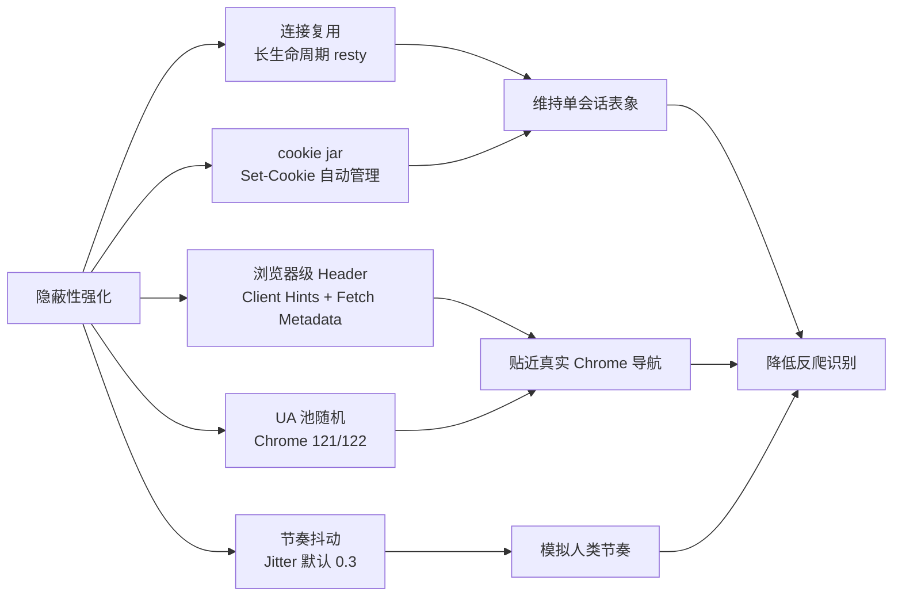
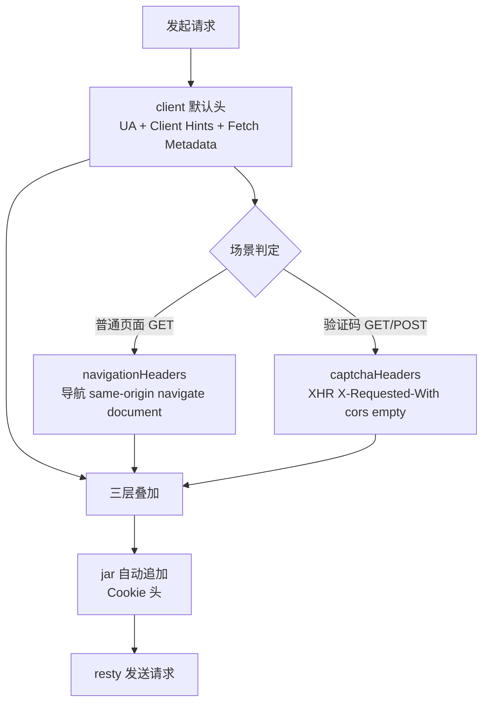

# 隐蔽性强化

`gojsl` 在收发 HTTP 时不是每次 `resty.New()`，而是持有一个长生命周期的 `HttpClient`，从连接、cookie、Header、UA、节奏五个维度协同降低被反爬识别为机器的概率。本页说明五维关系与 Header 拼装流程。源码位于 [`gojsl/httpclient.go`](https://github.com/scagogogo/cnvd-skills/blob/main/gojsl/httpclient.go) 与 [`gojsl/headers.go`](https://github.com/scagogogo/cnvd-skills/blob/main/gojsl/headers.go)。

## 五维隐蔽性

五个维度并非独立堆砌，而是协同维持"一个真实浏览器单会话"的表象：连接复用让 TCP/TLS 握手只发生一次；cookie jar 让 `__jsl_clearance_s` 等会话 cookie 自动续接；Header 全套对齐现代 Chrome；UA 池随机避免单一固定 UA 的指纹特征；节奏抖动模拟人类浏览间隔。



> **TLS 指纹未伪装**：当前隐蔽性聚焦连接/Header/UA/节奏四维，底层仍用 Go 标准库 `net/http` 的 TLS ClientHello（未引入 uTLS）。已验证可正常穿透 CNVD 加速乐三层 + 创宇盾验证码。详见 [TLS 指纹决策](/architecture/tls-fingerprint)。

## 连接复用

`HttpClient` 持有长生命周期的 `*resty.Client`，底层复用 TCP/TLS 连接（keep-alive），减少握手开销与 TLS 指纹抖动，贴近真实浏览器单会话行为。三层解密每一跳、验证码取图/提交/放行刷新都经同一 client，cookie jar 在整个会话内累积。

```go
func NewHttpClient(proxy string, timeoutSeconds int) *HttpClient {
    jar, _ := cookiejar.New(nil)
    client := resty.New().
        SetCookieJar(jar).
        SetHeaderVerbatim("Accept-Language", "zh-CN,zh;q=0.9").
        SetRedirectPolicy(resty.FlexibleRedirectPolicy(10))
    // proxy / timeout 配置...
    hc := &HttpClient{client: client}
    hc.ua = hc.pickUserAgent()
    hc.applyBrowserHeaders()
    return hc
}
```

`FlexibleRedirectPolicy(10)` 允许最多 10 次重定向，与浏览器一致（加速乐三层依赖 JS 跳转而非 HTTP 302，但保留以兼容普通页）。

## cookie jar 自动管理

`net/http/cookiejar` 自动收发 `Set-Cookie`：响应里的 cookie 进 jar，后续请求由 jar 统一携带 `Cookie` 头，无需手动拼接。三层解密算出的 `__jsl_clearance_s` 等中间产物经 `SetCookie` 写入 jar 后由 jar 统一携带，详见 [cookie 生命周期](/architecture/cookie-lifecycle)。

## 浏览器级 Header 全套

`userAgent.headers()` 返回现代 Chrome 必带的导航头，覆盖 Client Hints（`sec-ch-ua*`）与 Fetch Metadata（`Sec-Fetch-*`）：

```go
func (u userAgent) headers() map[string]string {
    chUa := fmt.Sprintf(`"Chromium";v="%s", "Not(A:Brand";v="24", "Google Chrome";v="%s"`, u.major, u.major)
    return map[string]string{
        "User-Agent":                u.ua,
        "Accept":                    "text/html,application/xhtml+xml,application/xml;q=0.9,image/avif,image/webp,*/*;q=0.8",
        "Accept-Language":           "zh-CN,zh;q=0.9",
        "Accept-Encoding":           "gzip, deflate",
        "sec-ch-ua":                 chUa,
        "sec-ch-ua-mobile":          "?0",
        "sec-ch-ua-platform":        fmt.Sprintf(`"%s"`, u.platform),
        "Sec-Fetch-Site":            "same-origin",
        "Sec-Fetch-Mode":            "navigate",
        "Sec-Fetch-User":            "?1",
        "Sec-Fetch-Dest":            "document",
        "Upgrade-Insecure-Requests": "1",
        "Connection":                "keep-alive",
    }
}
```

缺这些头是非浏览器的强特征：`sec-ch-ua` 与 UA 大版本必须联动（详见 [UA 池与 Client Hints](/architecture/ua-pool)），否则反爬可从 Client Hints 与 UA 不一致识别。

## UA 池随机

UA 从真实 Chrome 121/122（Win/Mac/Linux）池随机选取，Client Hints 头随之联动，避免单一固定 UA 的指纹特征。长会话可调 `RefreshUserAgent()` 轮换到新 UA（同时重设 Header）。

## 人类节奏抖动

`Config.Jitter`（默认 0.3，范围 ±30%）随机化翻页/详情/代理重试间隔；验证码取图前加 500~1500ms 人类看图反应延迟（`globalRand.Intn(1000)` + 500ms）：

```go
reactionDelay := time.Duration(500+globalRand.Intn(1000)) * time.Millisecond
```

抖动幅度可调：`0` 关闭抖动用固定间隔，`0.5` 表示 ±50%。

## Header 拼装流程

请求头由三层叠加：client 默认头（`applyBrowserHeaders` 设置的 UA + 浏览器级头）→ 场景头（`navigationHeaders` 或 `captchaHeaders`）→ resty jar 自动追加的 `Cookie` 头。三层叠加后对齐浏览器导航/XHR 行为。



`applyBrowserHeaders` 在 `NewHttpClient` 与 `RefreshUserAgent` 时把当前 UA 的全套头设到 client 默认头；`navigationHeaders` 仅在需要时附加 `Referer`；`captchaHeaders` 覆盖 `Accept` 与 `Sec-Fetch-*` 为 XHR 形态并加 `X-Requested-With` 与 `Referer`。

## 边界

- 一个 `HttpClient` 实例对应一个"浏览器会话"，非并发安全（cookie jar 会累积）。`JslClient` 内部持有一个，并发场景由 `requestWithRetry` 派生独立实例，详见 [并发模型](/architecture/concurrency-model)。
- 隐蔽性不替代代理：风控仍可能按 IP 频次拦截，需配合代理轮换（详见 [错误处理](/architecture/error-handling)）。

## 相关页面

- [UA 池与 Client Hints](/architecture/ua-pool) —— UA 与 `sec-ch-ua` 大版本联动
- [TLS 指纹决策](/architecture/tls-fingerprint) —— 为何不引 uTLS
- [cookie 生命周期](/architecture/cookie-lifecycle) —— jar 自动管理
- [并发模型](/architecture/concurrency-model) —— 会话不跨请求共享
- [go-jsl API：HttpClient](/api-gojsl/http-client)
