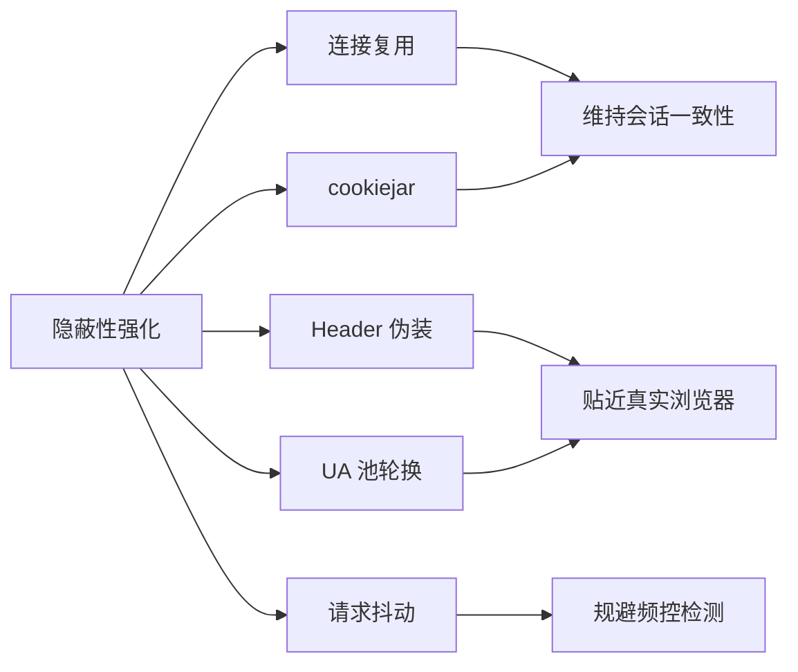

# 隐蔽性强化

本页说明 cnvd-skills 在反爬检测中使用的五个隐蔽性维度。

## 五维隐蔽性

通过连接复用、cookiejar、Header、UA 池、抖动协同降低被识别为爬虫的概率。

```mermaid
flowchart LR
    A[隐蔽性强化] --> B[连接复用]
    A --> C[cookiejar]
    A --> D[Header 伪装]
    A --> E[UA 池轮换]
    A --> F[请求抖动]
    B --> G[维持会话一致性]
    C --> G
    D --> H[贴近真实浏览器]
    E --> H
    F --> I[规避频控检测]
```

> 本页内容将在后续任务填充。
