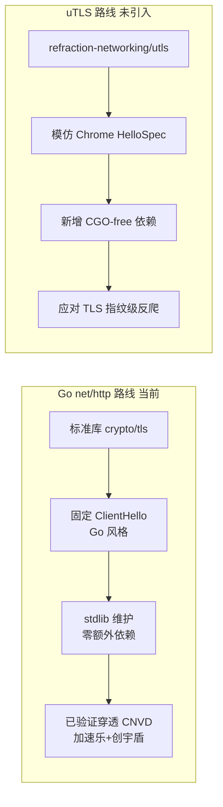
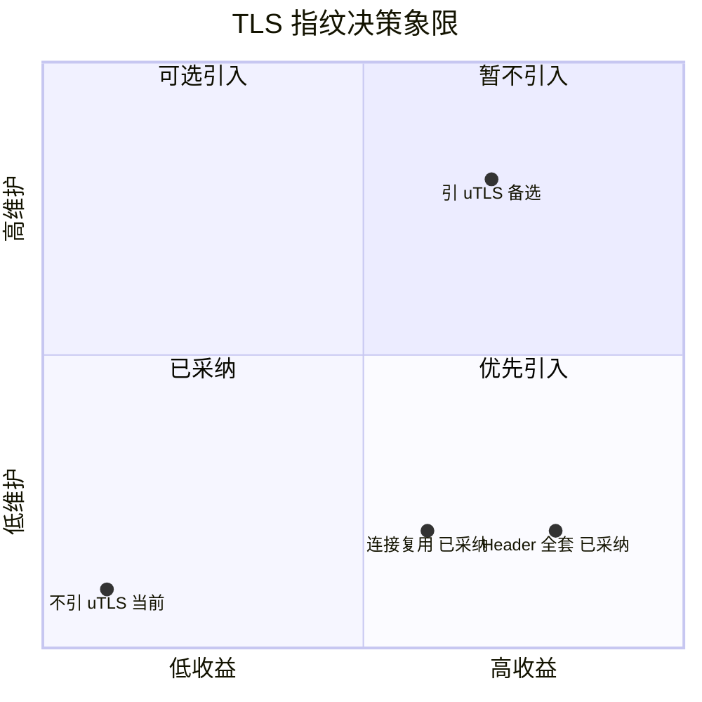

# TLS 指纹决策

当前 `gojsl` 的隐蔽性聚焦连接复用、cookie jar、Header、UA 池、节奏抖动五个维度，底层 HTTP 用 Go 标准库 `net/http` 的 TLS ClientHello，**未引入 [uTLS](https://github.com/refraction-networking/utls)**。本页说明这一决策的依据、Go 标准库与 uTLS 的对比，以及何时应考虑引入 uTLS。

## Go net/http vs uTLS 对比

TLS 指纹（ClientHello 的 cipher suite 顺序、扩展顺序、曲线列表等）是反爬可观测的维度之一。Go 标准库 `net/http` 的 TLS 指纹固定且与真实 Chrome 不同（例如 GREASE 扩展的位置、扩展顺序），uTLS 则能精确模仿 Chrome/Firefox/Safari 的 TLS 指纹。



两者关键差异：

| 维度 | Go net/http（当前） | uTLS（未引入） |
|------|---------------------|----------------|
| TLS 指纹 | 固定 Go 风格 | 精确模仿 Chrome |
| 依赖 | 仅 stdlib | 新增 utls 模块 |
| 维护成本 | 跟随 Go 版本 | 需同步 Chrome HelloSpec 更新 |
| 当前收益 | 已验证穿透 CNVD | 暂无目标站点需要 |
| 风险 | 无 | API 与 stdlib 不完全一致，需适配 |

## 决策矩阵

决策依据是"收益/成本/维护"三角。当前所有目标站点（CNVD 加速乐三层 + 创宇盾 + 图片验证码）均可正常穿透，反爬层级集中在应用层（JS 挑战 + 验证码 + 频控），未见 TLS 指纹级拦截，故引入 uTLS 的边际收益为零，却要付出依赖与维护成本。



各维度的决策依据：

- **不引 uTLS**：依赖新增、需同步 Chrome HelloSpec 更新、API 与 stdlib 不一致需适配；当前无目标站点在 TLS 指纹层拦截，收益 ≈ 0。归"暂不引入"。
- **连接复用**：复用 TCP/TLS 连接，零额外依赖，收益显著（减少握手 + 单会话表象），归"已采纳"。
- **Header 全套**：Client Hints + Fetch Metadata 与 UA 联动，零额外依赖，收益显著（避免非浏览器强特征），归"已采纳"。

## Go 标准库 TLS 路径

`resty` 底层用 `net/http`，`http.Transport` 持有 `*tls.Config`，TLS 握手由 `crypto/tls` 完成。`HttpClient` 通过 `resty.New()` 构造时未自定义 `DialContext` 或 `TLSClientConfig`，沿用默认配置（`resty` 内部按需注入代理与超时）：

```go
client := resty.New().
    SetCookieJar(jar).
    SetHeaderVerbatim("Accept-Language", "zh-CN,zh;q=0.9").
    SetRedirectPolicy(resty.FlexibleRedirectPolicy(10))
if proxy != "" { client.SetProxy(proxy) }
if timeoutSeconds > 0 {
    client.SetTimeout(time.Duration(timeoutSeconds) * time.Second)
}
```

`SetProxy` 让 resty 设置 `http.Transport.Proxy`，TLS 握手对目标站点（经代理隧道）发起。连接复用由 `http.Transport` 的连接池管理，同一 `resty.Client` 在同一会话内复用 TCP/TLS 连接。

## 何时应引入 uTLS

引入 uTLS 的触发条件（任一即应重新评估）：

1. CNVD 或目标站点升级到 TLS 指纹级反爬（如基于 JA3/JA4 指纹的拦截）。
2. 当前 Go 标准库 TLS 指纹被识别导致穿透失败，且 Header/UA/cookie/节奏四维均无法绕过。
3. 出现明确的 TLS 指纹拦截证据（如固定 ClientHello 被拒，换 UA/cookie 无效）。

引入方案：用 `utls.RoundTripper` 替换 `http.Transport` 的 `DialTLSContext`，按 UA 大版本选对应 Chrome HelloSpec（如 `HelloChrome_120`），与 [UA 池](/architecture/ua-pool) 的 `major` 联动。

> 当前未触发任何条件，故保持 stdlib 路线。详见 [go-jsl README 隐蔽性小节](https://github.com/scagogogo/cnvd-skills/blob/main/gojsl/README.md)。

## 相关页面

- [隐蔽性强化](/architecture/stealth) —— 五维隐蔽性
- [UA 池与 Client Hints](/architecture/ua-pool) —— UA 与 Client Hints 联动
- [设计取舍](/architecture/design-decisions) —— 关键决策矩阵
- [go-jsl API：HttpClient](/api-gojsl/http-client)
