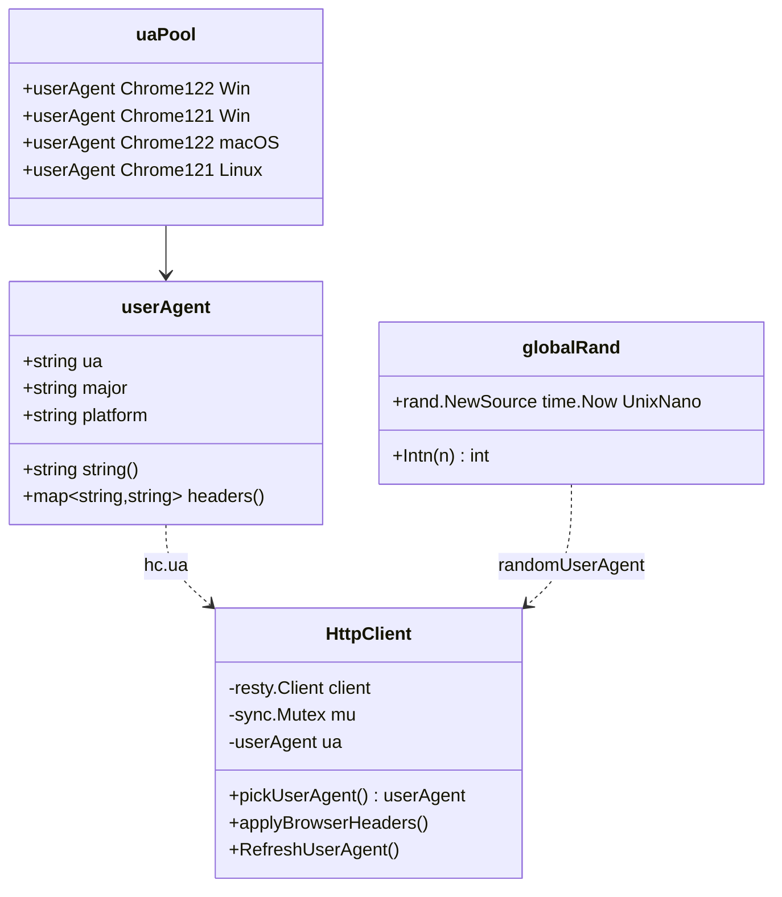
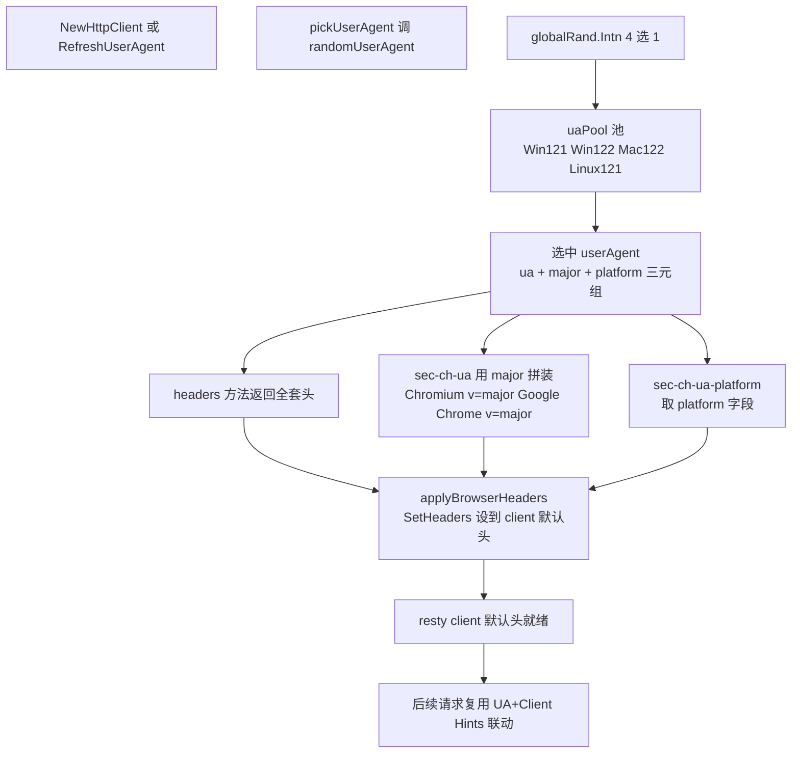

# UA 池与 Client Hints

`gojsl/headers.go` 维护一个真实 Chrome 稳定大版本 UA 池，并使 UA 大版本与 Client Hints（`sec-ch-ua`）联动，避免反爬从 UA 与 `sec-ch-ua` 不一致识别为非浏览器。本页说明 `userAgent` 结构与 UA 选择联动流程。

## userAgent 结构类图

`userAgent` 封装一个真实 Chrome 的 UA 字符串与其大版本号（`major`）和平台（`platform`），`headers()` 方法返回该 UA 对应的浏览器级默认 Header 全套。UA 与 `major` 必须联动——`sec-ch-ua` 中的版本号要与 UA 字符串中的 Chrome 大版本一致。



```go
type userAgent struct {
    ua       string
    major    string
    platform string
}
```

`headers()` 用 `major` 拼装 `sec-ch-ua`：

```go
func (u userAgent) headers() map[string]string {
    chUa := fmt.Sprintf(`"Chromium";v="%s", "Not(A:Brand";v="24", "Google Chrome";v="%s"`, u.major, u.major)
    return map[string]string{
        "User-Agent":         u.ua,
        "sec-ch-ua":          chUa,
        "sec-ch-ua-mobile":   "?0",
        "sec-ch-ua-platform": fmt.Sprintf(`"%s"`, u.platform),
        // 其余 Accept / Accept-Language / Sec-Fetch-* ...
    }
}
```

## UA 池

`uaPool` 是真实 Chrome 稳定大版本 UA 池，每项 UA 与 `major` / `platform` 联动：

```go
var uaPool = []userAgent{
    {ua: "Mozilla/5.0 (Windows NT 10.0; Win64; x64) ... Chrome/122.0.0.0 Safari/537.36", major: "122", platform: "Windows"},
    {ua: "Mozilla/5.0 (Windows NT 10.0; Win64; x64) ... Chrome/121.0.0.0 Safari/537.36", major: "121", platform: "Windows"},
    {ua: "Mozilla/5.0 (Macintosh; Intel Mac OS X 10_15_7) ... Chrome/122.0.0.0 Safari/537.36", major: "122", platform: "macOS"},
    {ua: "Mozilla/5.0 (X11; Linux x86_64) ... Chrome/121.0.0.0 Safari/537.36", major: "121", platform: "Linux"},
}
```

覆盖 Win/Mac/Linux 三平台 × Chrome 121/122 两个稳定大版本，共 4 个 UA。`globalRand` 是全局随机源（`gojsl` 是工具库，无需调用方注入源）：

```go
var globalRand = rand.New(rand.NewSource(time.Now().UnixNano()))

func randomUserAgent() userAgent {
    return uaPool[globalRand.Intn(len(uaPool))]
}
```

`NewHttpClient` 构造时随机选一个 UA 并 `applyBrowserHeaders` 设到 client 默认头；长会话可调 `RefreshUserAgent()` 轮换到新 UA（加锁保护，重设 Header）。

## UA 选择与 sec-ch-ua 联动流程

`pickUserAgent` 从池随机选一个 `userAgent`，`applyBrowserHeaders` 把该 UA 的全套头（含联动 `sec-ch-ua`）设到 client 默认头。之后所有请求复用这套头，保证 UA 与 Client Hints 大版本一致。



## 为何要联动

现代 Chrome 在导航请求中会自动发送 Client Hints（`sec-ch-ua` / `sec-ch-ua-mobile` / `sec-ch-ua-platform`），其中的版本号来自浏览器自身大版本。若 UA 字符串声明 Chrome 122 而 `sec-ch-ua` 写 Chrome 121，反爬一眼可识别为伪造。同理 `sec-ch-ua-platform` 必须与 UA 中的平台标识一致（Windows/macOS/Linux）。

`headers()` 中 `sec-ch-ua` 形如 `"Chromium";v="122", "Not(A:Brand";v="24", "Google Chrome";v="122"`，与 [真实 Chrome 格式](https://developer.mozilla.org/docs/Web/HTTP/Headers/User-Agent_Client_Hints) 一致。`sec-ch-ua-mobile: ?0` 表示桌面端（非移动）。

## Fetch Metadata 与场景头

除 Client Hints 外，`headers()` 还覆盖 Fetch Metadata（`Sec-Fetch-Site/Mode/User/Dest`），对齐现代 Chrome 导航请求：`same-origin / navigate / ?1 / document`。验证码 XHR 请求由 `captchaHeaders` 覆盖为 `same-origin / cors / empty` 并加 `X-Requested-With: XMLHttpRequest`（CNVD 的 `captcha.js` 仍检查它）。详见 [隐蔽性强化](/architecture/stealth) 的 Header 拼装流程。

## 长会话轮换

`RefreshUserAgent()` 加 `mu.Lock` 后重新选 UA 并 `applyBrowserHeaders`，供长会话定期换装降低指纹固定风险。注意：由于 `JslClient` 不跨请求共享（详见 [并发模型](/architecture/concurrency-model)），通常每次请求构造新 `HttpClient` 时已自动随机选 UA，`RefreshUserAgent` 主要用于库内长会话或调试场景。

## 相关页面

- [隐蔽性强化](/architecture/stealth) —— UA 池作为五维之一
- [TLS 指纹决策](/architecture/tls-fingerprint) —— TLS 指纹未伪装的决策
- [并发模型](/architecture/concurrency-model) —— 每请求重新选 UA
- [go-jsl API：HttpClient](/api-gojsl/http-client)
