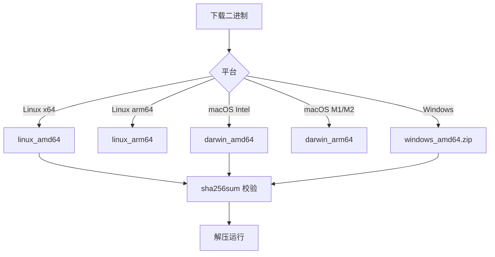

# 二进制下载

从 GitHub Releases 下载预编译二进制，免编译直接运行。

## 获取

到 [Releases 页面](https://github.com/scagogogo/cnvd-skills/releases) 选择对应版本与平台。

## 平台矩阵

| 文件 | 平台 |
|------|------|
| `cnvd-skills_linux_amd64.tar.gz` | Linux x86_64 |
| `cnvd-skills_linux_arm64.tar.gz` | Linux arm64 |
| `cnvd-skills_darwin_amd64.tar.gz` | macOS Intel |
| `cnvd-skills_darwin_arm64.tar.gz` | macOS Apple Silicon |
| `cnvd-skills_windows_amd64.zip` | Windows x86_64 |
| `checksums.txt` | 校验和 |

## 下载与校验

```bash
# 下载
curl -LO https://github.com/scagogogo/cnvd-skills/releases/download/v0.1.0/cnvd-skills_linux_amd64.tar.gz
curl -LO https://github.com/scagogogo/cnvd-skills/releases/download/v0.1.0/checksums.txt

# 校验
sha256sum -c --ignore-missing checksums.txt

# 解压
tar xzf cnvd-skills_linux_amd64.tar.gz
./cnvd-skills --help
```

## 选择流程



## macOS Gatekeeper

macOS 首次运行可能被 Gatekeeper 拦截：

```bash
xattr -d com.apple.quarantine cnvd-skills
./cnvd-skills --help
```

或在"系统设置 → 隐私与安全性"中允许。

## 验证码识别器依赖

二进制本身不含 ddddocr。若需验证码全自动，仍需安装 Python + ddddocr，并通过 `CommandCaptchaSolver` 调用。详见 [ddddocr 安装](/faq/ddddocr-install)。

## 升级

下载新版本替换二进制即可。配置文件与数据目录与二进制解耦，升级不影响。

## 相关

- [源码编译](/faq/build-from-source)
- [ddddocr 安装](/faq/ddddocr-install)
- [CI 集成示例](/faq/ci-integration)
- [Docker 化运行](/faq/docker)
