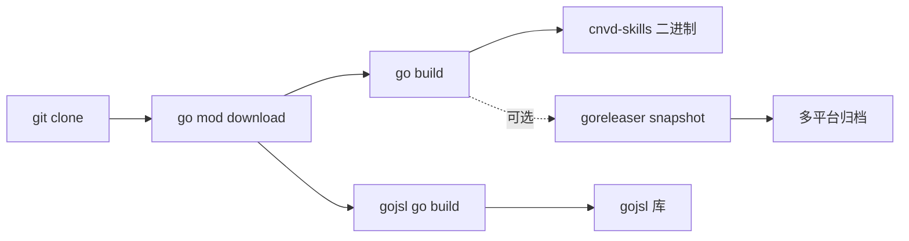

# 源码编译

从源码编译 cnvd-skills CLI 与 go-jsl 库。

## 前置

- Go 1.18+
- Git

## 克隆

```bash
git clone https://github.com/scagogogo/cnvd-skills.git
cd cnvd-skills
```

## 编译 CLI

```bash
go build -o cnvd-skills .
./cnvd-skills --help
```

## 编译 go-jsl（独立）

```bash
cd gojsl
go build ./...
go test ./... -short -v
cd ..
```

## 验证 gojsl 独立可编译

monorepo replace 机制下，gojsl 应能独立编译（不依赖 cnvd-skills 根）：

```bash
cd gojsl
go vet ./...
go build ./...
```

详见 [monorepo replace](/faq/monorepo-replace)。

## 跨平台编译

```bash
# Linux amd64
GOOS=linux GOARCH=amd64 go build -o cnvd-skills-linux-amd64 .

# macOS arm64
GOOS=darwin GOARCH=arm64 go build -o cnvd-skills-darwin-arm64 .

# Windows amd64
GOOS=windows GOARCH=amd64 go build -o cnvd-skills-windows-amd64.exe .
```

## goreleaser（推荐用于发布）

仓库含 `.goreleaser.yaml`，可一次构建多平台归档：

```bash
goreleaser release --snapshot --clean
ls dist/
```

详见发布流程文档。二进制下载见 [二进制下载](/faq/binary-download)。

## 构建流程



## 依赖

```bash
go mod download
go mod tidy
```

依赖 goja（JS 引擎）与 go-resty v2，详见 [README](https://github.com/scagogogo/cnvd-skills/blob/main/gojsl/README.md)。

## 相关

- [二进制下载](/faq/binary-download)
- [monorepo replace 机制](/faq/monorepo-replace)
- [Go 1.18 兼容](/faq/go-1.18-compat)
- [Docker 化运行](/faq/docker)
