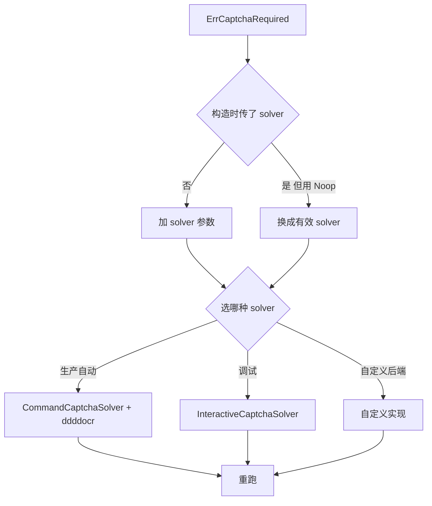

# 遇 ErrCaptchaRequired 怎么办

`ErrCaptchaRequired` 表示响应为验证码挑战页但未配置 `CaptchaSolver`。本页给出排查与解决步骤。

## 错误字面量

```go
ErrCaptchaRequired = errors.New("captcha challenge required but no solver configured")
```

## 触发条件

`JslClient.handlePossibleCaptcha` 检测到 `isCaptchaChallenge(body)` 为 true 且 `solver == nil`。详见 [ErrCaptchaRequired 详解](/api-gojsl/types/err-captcha-required)。

## 决策树



## 解决方案

### 1. 配置 CommandCaptchaSolver（推荐生产）

```go
client := jsl.NewJslClient("", 60, jsl.CommandCaptchaSolver{
    Command: "python3",
    Args:    []string{"scripts/ddddocr_solver.py"},
})
```

前置：安装 ddddocr（见 [ddddocr 安装](/faq/ddddocr-install)）。

### 2. 配置 InteractiveCaptchaSolver（调试）

```go
client := jsl.NewJslClient("", 120, jsl.InteractiveCaptchaSolver{
    ImageDir: "/tmp/cnvd-captcha",
})
```

详见 [验证码交互示例](/api-gojsl/examples/captcha-interactive)。

### 3. 自定义实现

详见 [自定义 Solver 示例](/api-gojsl/examples/custom-solver)。

## 验证 solver 已生效

```go
if !client.HasSolver() {
    log.Fatal("solver not configured")
}
```

> 注：`NoopCaptchaSolver` 非空指针，`HasSolver` 返回 true，但其 `Solve` 永远返回 `ErrCaptchaRequired`。如需真正识别，用 `CommandCaptchaSolver` 等。

## 相关

- [ErrCaptchaRequired 详解](/api-gojsl/types/err-captcha-required)
- [错误变量](/api-gojsl/errors)
- [Solver 实现详解](/api-gojsl/solver-implementations)
- [识别失败排查](/faq/captcha-solve-failed)
