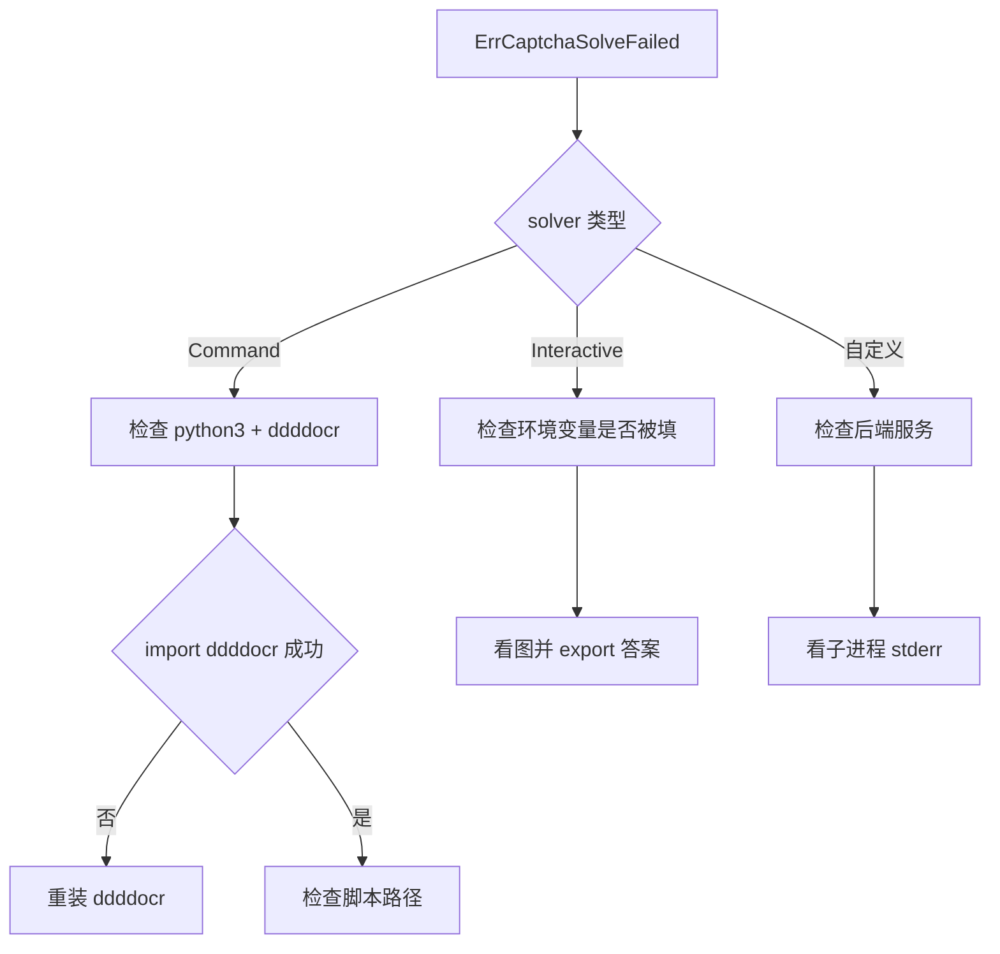
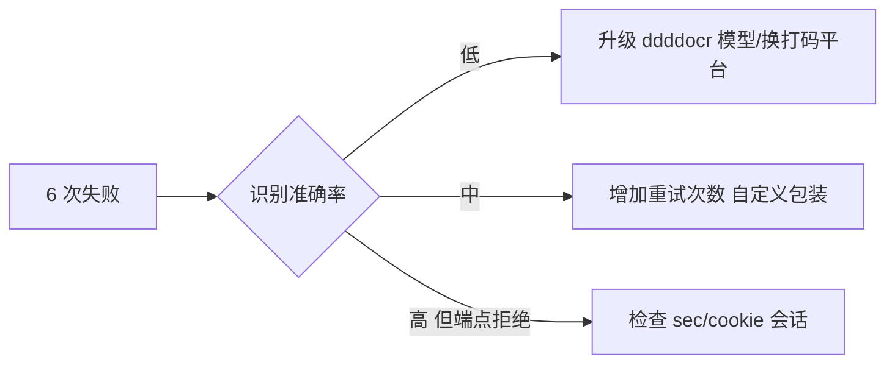

# 识别失败排查

`ErrCaptchaSolveFailed` 表示配置了 solver 但 6 次重试均失败。本页给出排查步骤。

## 错误字面量

```go
ErrCaptchaSolveFailed = errors.New("captcha solve failed after retries")
```

## 排查决策树



## CommandCaptchaSolver 排查

错误信息含子进程 stderr，定位最直接：

```go
html, err := client.Get(ctx, url)
if errors.Is(err, jsl.ErrCaptchaSolveFailed) {
    log.Println(err) // 含 stderr
}
```

常见原因：
- `python3` 不在 PATH：用绝对路径 `/usr/bin/python3`。
- ddddocr 未安装：`pip install ddddocr`，见 [ddddocr 安装](/faq/ddddocr-install)。
- 脚本路径错误：`scripts/ddddocr_solver.py` 相对工作目录。
- ddddocr 识别准确率：中文词组有概率性，6 次重试通常足够；若仍失败，考虑换识别模型或人工兜底。

## InteractiveCaptchaSolver 排查

- 确认 `AnswerEnv` 设置正确（默认 `CNVD_CAPTCHA_ANSWER`）。
- 确认 `ImageDir` 下生成了 png，人工看图后 `export CNVD_CAPTCHA_ANSWER=答案`。
- 确认 `WaitTimeout` 足够（默认 5 分钟）。

## 取图/提交端点排查

`processCaptcha` 取图与提交端点固定为 `https://www.cnvd.org.cn/cdn-cgi/captcha/v2/captcha/image`。若 CNVD 改版，端点可能变化，见 [CNVD 改版应对](/faq/cnvd-changed)。

## 提交返回非 200

错误答案通常返回 401。`captchaRequest` 对非 200 返回 `captcha endpoint returned %d`，触发上层重试。6 次均失败即 `ErrCaptchaSolveFailed`。

## 提升通过率



> 注：`maxAttempts=6` 是库内常量，不可配置。需更多重试可在调用方包装 `Get` 调用（遇 `ErrCaptchaSolveFailed` 重新构造 client 重试）。

## 相关

- [ErrCaptchaSolveFailed 详解](/api-gojsl/types/err-captcha-solve-failed)
- [processCaptcha 内部](/api-gojsl/methods/process-captcha-internals)
- [ddddocr 安装](/faq/ddddocr-install)
- [遇 ErrCaptchaRequired 怎么办](/faq/captcha-required-error)
