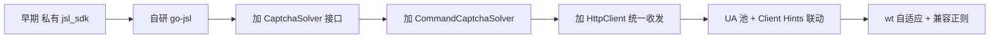

# 版本变更说明

go-jsl 与 cnvd-skills 的版本变更摘要。完整历史见 [GitHub Releases](https://github.com/scagogogo/cnvd-skills/releases) 与 git log。

## 版本演进

## 关键变更

### 移除私有 jsl_sdk

早期依赖私有 `jsl_sdk` 包，移除并自研纯 Go 的 `go-jsl`，可 `go get`。详见 [移除 jsl_sdk 原因](/faq/jsl-sdk-removed)。

### 可插拔 CaptchaSolver

引入 `CaptchaSolver` 接口，把"图→答案"留给调用方，内置 Noop/Static/Interactive/Command 四实现。详见 [CaptchaSolver 接口](/api-gojsl/captcha-solver)。

### CommandCaptchaSolver

新增 `CommandCaptchaSolver`，通过外部命令（如 ddddocr）识别，保持 go-jsl 为纯 Go。详见 [CommandCaptchaSolver](/api-gojsl/types/command-captcha-solver)。

### 统一 HttpClient

引入 `HttpClient` 持有长生命周期 resty client，复用 TCP/TLS、cookie jar 自动管理、浏览器级 Header。三层解密每一跳与验证码流程都经它收发。详见 [HttpClient 类型](/api-gojsl/http-client)。

### UA 池 + Client Hints

4 个真实 Chrome 121/122 UA 池，`sec-ch-ua` 大版本与 `sec-ch-ua-platform` 联动。详见 [UA 池内部](/api-gojsl/types/ua-pool-internals)。

### wt 自适应 + 兼容正则

第二层用解析出的 `wt` 休眠（非硬编码 1500），扣除计算耗时；第一层正则兼容 `; Max-age` 大小写空格组合。详见 [三层解密深度解析](/api-gojsl/three-layers-deep-dive)。

### 列表分页解析修复

修复 list 分页解析以匹配真实 CNVD 结构（见 commit `eb68b96`）。

### JslClient 导出为公开 module

`go-jsl` 作为独立 module 导出，`CnvdSkills` 持有默认实例，`requestWithRetry` 成为方法（见 commit `76534af`、`d7eae68`）。

## 版本号

遵循 [SemVer](https://semver.org/)。`go-jsl` 在 monorepo 内独立打 tag（如 `gojsl/v0.1.0`）。详见 [monorepo replace](/faq/monorepo-replace)。

## 升级

- 二进制：下载新版本替换，见 [二进制下载](/faq/binary-download)。
- 库：`go get -u github.com/scagogogo/go-jsl@latest`。
- 破坏性变更见 Release Notes。

## 相关

- [为何自研加速乐客户端](/faq/why-self-implementation)
- [移除私有 jsl_sdk 原因](/faq/jsl-sdk-removed)
- [monorepo replace 机制](/faq/monorepo-replace)
- [GitHub Releases](https://github.com/scagogogo/cnvd-skills/releases)
