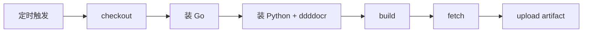

# CI 集成示例

在 CI 中用 cnvd-skills 定期抓取 CNVD 漏洞信息。

## GitHub Actions 示例

```yaml
# .github/workflows/cnvd-daily.yml
name: CNVD Daily Fetch
on:
  schedule:
    - cron: '0 2 * * *'  # 每天北京时间 10:00
  workflow_dispatch:

jobs:
  fetch:
    runs-on: ubuntu-latest
    steps:
      - uses: actions/checkout@v4

      - name: Set up Go
        uses: actions/setup-go@v5
        with:
          go-version: '1.22'

      - name: Set up Python + ddddocr
        uses: actions/setup-python@v5
        with:
          python-version: '3.11'
      - run: pip install ddddocr

      - name: Build
        run: go build -o cnvd-skills .

      - name: Fetch today
        env:
          CNVD_CAPTCHA_ANSWER: ''
        run: |
          ./cnvd-skills vul-list --since 2026-07-20 --output today.jsonl

      - name: Upload artifact
        uses: actions/upload-artifact@v4
        with:
          name: cnvd-today
          path: today.jsonl
```

## 流程



## 二进制版（免编译）

若 Release 已有对应平台二进制，可直接下载：

```yaml
- name: Download binary
  run: |
    curl -LO https://github.com/scagogogo/cnvd-skills/releases/download/v0.1.0/cnvd-skills_linux_amd64.tar.gz
    tar xzf cnvd-skills_linux_amd64.tar.gz
    chmod +x cnvd-skills
- name: Fetch
  run: ./cnvd-skills vul-list --output today.jsonl
```

## ddddocr 注意

CI 环境（ubuntu）可能遇 PEP668，用 venv 或 `--break-system-package`：

```yaml
- run: |
    python3 -m venv ~/.venv/ddddocr
    source ~/.venv/ddddocr/bin/activate
    pip install ddddocr
```

`CommandCaptchaSolver` 的 Command 用 venv 内 python：`/home/runner/.venvs/ddddocr/bin/python3`。详见 [ddddocr 安装](/faq/ddddocr-install)。

## 代理

若 CI IP 被限流，配代理：

```yaml
- name: Fetch with proxy
  env:
    HTTP_PROXY: ${{ secrets.PROXY_URL }}
  run: ./cnvd-skills vul-list --proxy ${{ secrets.PROXY_URL }} --output today.jsonl
```

## 失败重试

GitHub Actions 自带重试机制，也可在脚本内加退避重试（见 [被限流怎么办](/faq/rate-limit)）。

## 相关

- [二进制下载](/faq/binary-download)
- [源码编译](/faq/build-from-source)
- [ddddocr 安装](/faq/ddddocr-install)
- [JSONL 输出解析](/faq/output-jsonl-parse)
- [Docker 化运行](/faq/docker)
