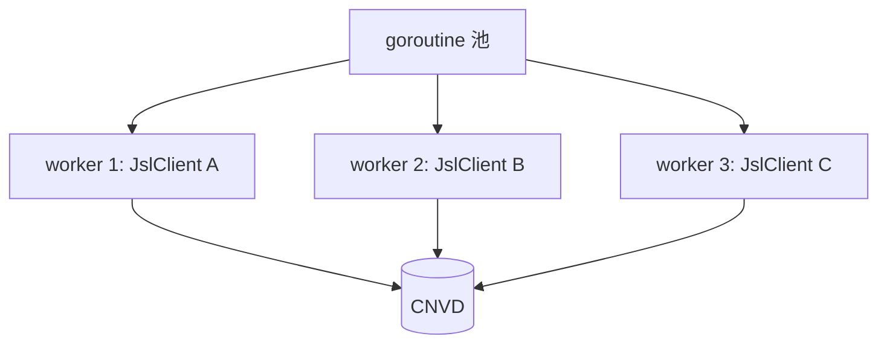

# 并发使用注意事项

go-jsl 的 `JslClient` 与 `HttpClient` 单实例非并发安全，并发场景需为每个请求构造独立实例。

## 非并发安全的原因

| 组件 | 非安全原因 |
|------|-----------|
| `HttpClient.client` (resty) | cookie jar 会随请求累积，多请求并发写 jar 冲突 |
| `JslClient.cookieMap` | 三层解密中间产物，并发写 map 冲突 |
| `JslClient.targetSite` | 首次请求后缓存，并发首请求可能重复解析 |
| `globalRand` | `*rand.Rand` 并发调用不安全（单实例内顺序用无碍） |

## 推荐模型：每请求独立实例



每个 worker 持有独立 `JslClient`，cookie jar 隔离，互不干扰。

## 示例

```go
package main

import (
    "context"
    "log"
    "sync"

    "github.com/scagogogo/go-jsl"
)

func fetch(ctx context.Context, url string, solver jsl.CaptchaSolver) (string, error) {
    // 每次调用构造独立实例
    c := jsl.NewJslClient("", 60, solver)
    return c.Get(ctx, url)
}

func main() {
    solver := jsl.CommandCaptchaSolver{
        Command: "python3",
        Args:    []string{"scripts/ddddocr_solver.py"},
    }
    urls := []string{
        "https://www.cnvd.org.cn/flaw/show/CNVD-2021-67823",
        "https://www.cnvd.org.cn/flaw/show/CNVD-2021-67824",
        "https://www.cnvd.org.cn/flaw/show/CNVD-2021-67825",
    }

    var wg sync.WaitGroup
    for _, u := range urls {
        wg.Add(1)
        go func(url string) {
            defer wg.Done()
            html, err := fetch(context.Background(), url, solver)
            log.Printf("%s err=%v len=%d", url, err, len(html))
        }(u)
    }
    wg.Wait()
}
```

## 并发 + 代理轮换

每 worker 用不同代理，进一步降低单 IP 被限流风险：

```go
func fetchWithProxy(proxy, url string) (string, error) {
    c := jsl.NewJslClient(proxy, 30, solver)
    return c.Get(context.Background(), url)
}
```

## 限流配合

并发度不宜过高，否则触发限流（见 [被限流怎么办](/faq/rate-limit)）。建议用带缓冲 channel 控制并发数：

```go
sem := make(chan struct{}, 3) // 并发 3
for _, u := range urls {
    sem <- struct{}{}
    go func(url string) {
        defer func() { <-sem }()
        _, _ = fetch(ctx, url, solver)
    }(u)
}
```

## 相关

- [JslClient 结构](/api-gojsl/types/jsl-client-struct)
- [HttpClient 结构](/api-gojsl/types/http-client-struct)
- [被限流怎么办](/faq/rate-limit)
- [代理与超时示例](/api-gojsl/examples/proxy-timeout)
- [架构 - 并发模型](/architecture/concurrency-model)
