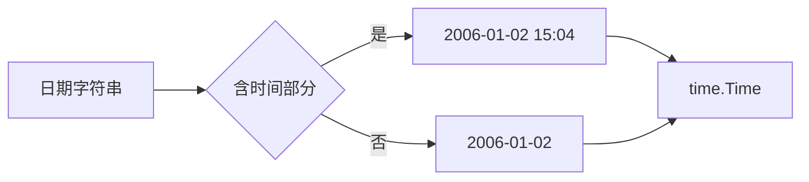

# 日期字段格式

cnvd-skills 抓取的日期字段格式说明与解析。

## CNVD 原始格式

CNVD 站点公布的日期通常为 `YYYY-MM-DD` 或 `YYYY-MM-DD HH:mm` 字符串，如：

- `2021-12-31`
- `2021-12-31 14:30`

## 解析（Go）

```go
package main

import (
    "log"
    "time"
)

func parseDate(s string) time.Time {
    layouts := []string{
        "2006-01-02 15:04",
        "2006-01-02",
    }
    for _, l := range layouts {
        if t, err := time.Parse(l, s); err == nil {
            return t
        }
    }
    log.Printf("unparseable date: %s", s)
    return time.Time{}
}

func main() {
    log.Println(parseDate("2021-12-31"))
    log.Println(parseDate("2021-12-31 14:30"))
}
```

## 字段

常见日期字段（详见 [VulDetail 字段](/api-cnvd-skills/types/vul-detail-fields)）：

| 字段 | 含义 |
|------|------|
| `pub_date` / 发布时间 | 漏洞公开时间 |
| `update_date` / 更新时间 | 漏洞信息更新时间 |
| `submit_date` | 提交时间（如有） |

## 解析流程



## 时区

CNVD 日期为北京时间（UTC+8）。`time.Parse` 得到 UTC 时间点；若需本地表示，用 `time.ParseInLocation(layout, s, time.FixedZone("CST", 8*3600))`。

```go
loc := time.FixedZone("CST", 8*3600)
t, _ := time.ParseInLocation("2006-01-02", "2021-12-31", loc)
```

## 输出 JSONL 时

若字段保留原始字符串，JSONL 中即为字符串；若解析为 `time.Time`，JSON 序列化为 RFC3339（`2021-12-31T00:00:00Z`）。解析端按需处理。详见 [JSONL 输出解析](/faq/output-jsonl-parse)。

## 相关

- [VulDetail 字段](/api-cnvd-skills/types/vul-detail-fields)
- [JSONL 输出解析](/faq/output-jsonl-parse)
- [cnvd-skills 字段速查](/api-cnvd-skills/fields-reference)
