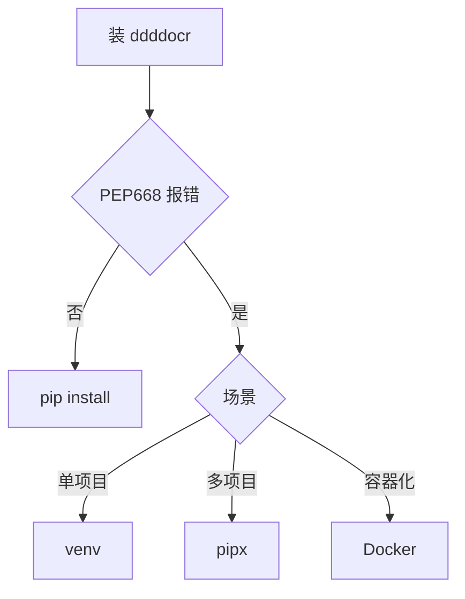

# ddddocr 安装与 PEP668

`CommandCaptchaSolver` 配合 `scripts/ddddocr_solver.py` 使用 ddddocr 识别中文词组验证码。本页说明安装与常见问题。

## 安装

```bash
pip install ddddocr
```

验证：

```bash
python3 -c "import ddddocr; print('ok')"
```

## PEP668 问题

Debian/Ubuntu 较新版本（含 Python 3.11+）启用 PEP668，禁止 `pip install` 直接装到系统 Python，会报 `error: externally-managed-environment`。

解决方案（任选其一）：

### 1. venv（推荐）

```bash
python3 -m venv ~/.venvs/ddddocr
source ~/.venvs/ddddocr/bin/activate
pip install ddddocr
```

`CommandCaptchaSolver` 用 venv 内的 python：

```go
jsl.CommandCaptchaSolver{
    Command: "/home/user/.venvs/ddddocr/bin/python3",
    Args:    []string{"scripts/ddddocr_solver.py"},
}
```

### 2. pipx（适合命令行工具）

```bash
pipx install ddddocr
```

### 3. pip --break-system-packages（不推荐）

```bash
pip install --break-system-packages ddddocr
```

可能破坏系统 Python 包，仅临时调试用。

### 4. Docker

用容器内 Python，见 [Docker 化运行](/faq/docker)。

## 选择决策



## ddddocr_solver.py

仓库自带 `scripts/ddddocr_solver.py`，从 stdin 读 base64 图片 → ddddocr 识别 → stdout 输出答案。`CommandCaptchaSolver` 把 base64 写到 stdin、从 stdout 读答案。

```python
# scripts/ddddocr_solver.py（示意）
import sys, base64, ddddocr
img_b64 = sys.stdin.read()
img = base64.b64decode(img_b64)
ocr = ddddocr.DdddOcr()
print(ocr.classification(img))
```

## 性能注意

ddddocr 首次加载模型较慢（数秒）。`CommandCaptchaSolver` 每次识别都起新子进程，单次约 1-3 秒。若需高频识别，考虑自建常驻 OCR 服务 + 自定义 Solver（见 [自定义 Solver 示例](/api-gojsl/examples/custom-solver)）。

## 相关

- [CommandCaptchaSolver](/api-gojsl/types/command-captcha-solver)
- [验证码全自动示例](/api-gojsl/examples/captcha-auto)
- [识别失败排查](/faq/captcha-solve-failed)
- [Docker 化运行](/faq/docker)
