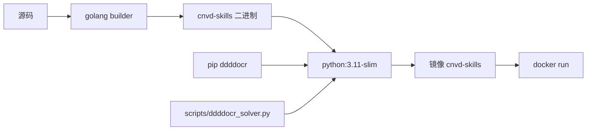

# Docker 化运行

用 Docker 容器化运行 cnvd-skills，内置 Go 二进制 + Python + ddddocr。

## Dockerfile 示例

```dockerfile
FROM python:3.11-slim AS base

RUN apt-get update && apt-get install -y --no-install-recommends \
        ca-certificates curl \
    && rm -rf /var/lib/apt/lists/*

# ddddocr
RUN pip install --no-cache-dir ddddocr

# 二进制（从 Release 下载或本仓库构建）
COPY cnvd-skills /usr/local/bin/cnvd-skills
COPY scripts/ddddocr_solver.py /app/scripts/ddddocr_solver.py

WORKDIR /app
ENTRYPOINT ["cnvd-skills"]
```

## 多阶段构建（从源码）

```dockerfile
FROM golang:1.22 AS builder
WORKDIR /src
COPY . .
RUN CGO_ENABLED=0 go build -o cnvd-skills .

FROM python:3.11-slim
RUN pip install --no-cache-dir ddddocr
COPY --from=builder /src/cnvd-skills /usr/local/bin/cnvd-skills
COPY scripts/ddddocr_solver.py /app/scripts/ddddocr_solver.py
WORKDIR /app
ENTRYPOINT ["cnvd-skills"]
```

## 构建与运行

```bash
docker build -t cnvd-skills .
docker run --rm -v "$PWD/data:/app/data" cnvd-skills vul-list --output data/today.jsonl
```

## 构建流程



## ddddocr 路径

容器内 ddddocr 在系统 Python（`python3`），`CommandCaptchaSolver` 用：

```go
jsl.CommandCaptchaSolver{
    Command: "python3",
    Args:    []string{"/app/scripts/ddddocr_solver.py"},
}
```

## 数据卷

把 `data/` 挂为卷，持久化 JSONL 输出：

```bash
docker run --rm -v "$PWD/data:/app/data" cnvd-skills vul-list --output /app/data/today.jsonl
```

## 代理

容器内访问外网若需代理：

```bash
docker run --rm -e HTTP_PROXY=http://host.docker.internal:7890 cnvd-skills vul-list
```

## CI 中用 Docker

GitHub Actions 可直接用发布的镜像：

```yaml
- name: Fetch
  run: |
    docker run --rm -v "$PWD/data:/app/data" cnvd-skills:latest \
      vul-list --output /app/data/today.jsonl
```

详见 [CI 集成示例](/faq/ci-integration)。

## 相关

- [源码编译](/faq/build-from-source)
- [二进制下载](/faq/binary-download)
- [ddddocr 安装](/faq/ddddocr-install)
- [CI 集成示例](/faq/ci-integration)
