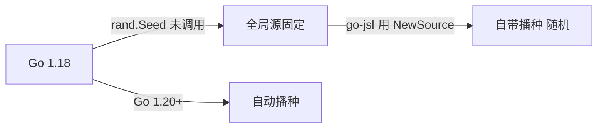

# Go 1.18 兼容性

go-jsl 与 cnvd-skills 兼容 Go 1.18 工具链。本页说明相关注意事项。

## go.mod 版本

```
go 1.18
```

选用 1.18 作为最低版本，兼顾较老的 CI/部署环境。

## rand seed

Go 1.20 之前 `math/rand` 全局源需手动 `rand.Seed`，否则进程启动序列固定。go-jsl 用 `rand.New(rand.NewSource(time.Now().UnixNano()))` 自带播种，不依赖全局 `rand.Seed`，在 Go 1.18 下也能保证启动随机性。详见 [globalRand 内部](/api-gojsl/types/global-rand-internals)。



## goja 与 resty

依赖 goja（JS 引擎）与 go-resty v2，均兼容 Go 1.18。`go mod tidy` 会拉取兼容版本。

## 工具链注意

- Go 1.18 不支持 `any` 别名前的某些泛型写法（`any` 本身 1.18 引入，可用）。
- `go build` / `go test` 在 1.18 下正常工作。
- 若 CI 用更新版本（如 1.22），`go.mod` 的 `go 1.18` 仅是最低声明，不影响编译。

## 升级建议

若你的环境支持 Go 1.20+，可考虑：
- 升级 `go.mod` 的 `go` 指令到 1.20+，去掉手动播种（但 go-jsl 的 `NewSource` 仍兼容）。
- 用 `errors.Join`（1.20+）等多返回值错误聚合。

但当前为兼容性保留 1.18。

## 相关

- [globalRand 内部](/api-gojsl/types/global-rand-internals)
- [源码编译](/faq/build-from-source)
- [monorepo replace 机制](/faq/monorepo-replace)
