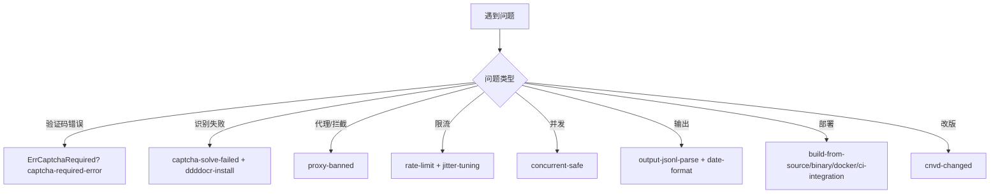

# FAQ 索引

本页索引 cnvd-skills / go-jsl 常见问题与 cookbook。按主题分组，点击进入详情。

## 设计与选型

- [为何自研加速乐客户端](/faq/why-self-implementation) — 对比现成库的取舍
- [移除私有 jsl_sdk 原因](/faq/jsl-sdk-removed) — 为何不再依赖私有 SDK
- [monorepo replace 机制](/faq/monorepo-replace) — go-jsl 在 monorepo 中的 replace 用法
- [Go 1.18 兼容](/faq/go-1.18-compat) — rand seed、工具链兼容说明

## 验证码

- [遇 ErrCaptchaRequired 怎么办](/faq/captcha-required-error)
- [识别失败排查](/faq/captcha-solve-failed)
- [ddddocr 安装与 PEP668](/faq/ddddocr-install)

## 网络/反爬

- [代理被封（创宇盾）排查](/faq/proxy-banned)
- [被限流怎么办](/faq/rate-limit)
- [Jitter 调参](/faq/jitter-tuning)
- [并发使用注意事项](/faq/concurrent-safe)

## 输出与数据

- [JSONL 输出解析](/faq/output-jsonl-parse)
- [日期字段格式](/faq/date-format)
- [CNVD 改版如何应对](/faq/cnvd-changed)

## 部署与运维

- [源码编译](/faq/build-from-source)
- [二进制下载](/faq/binary-download)
- [CI 集成示例](/faq/ci-integration)
- [Docker 化运行](/faq/docker)
- [性能调优](/faq/performance)
- [安全使用须知](/faq/security-notice)

## 变更

- [版本变更说明](/faq/changelog)

## 问题分流决策树

无法解决时请到 [GitHub Issues](https://github.com/scagogogo/cnvd-skills/issues) 提问，附错误信息与复现步骤。
