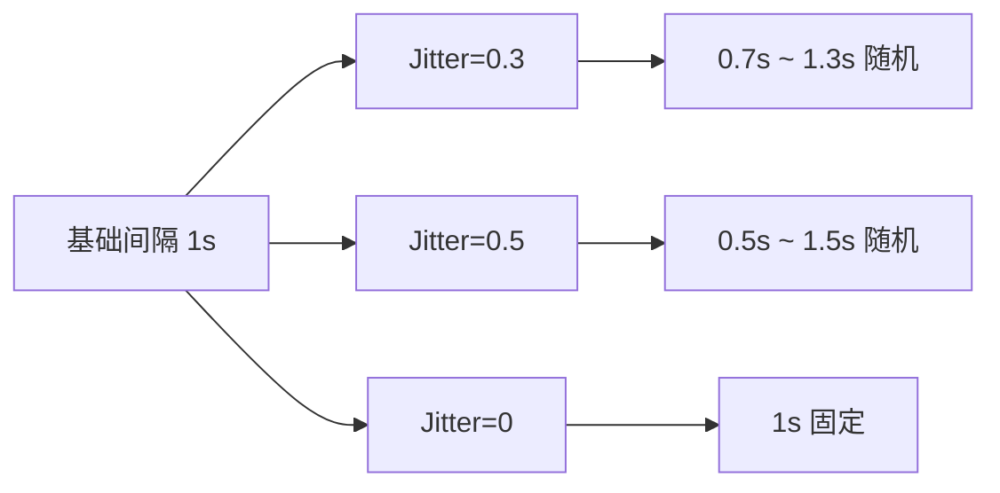
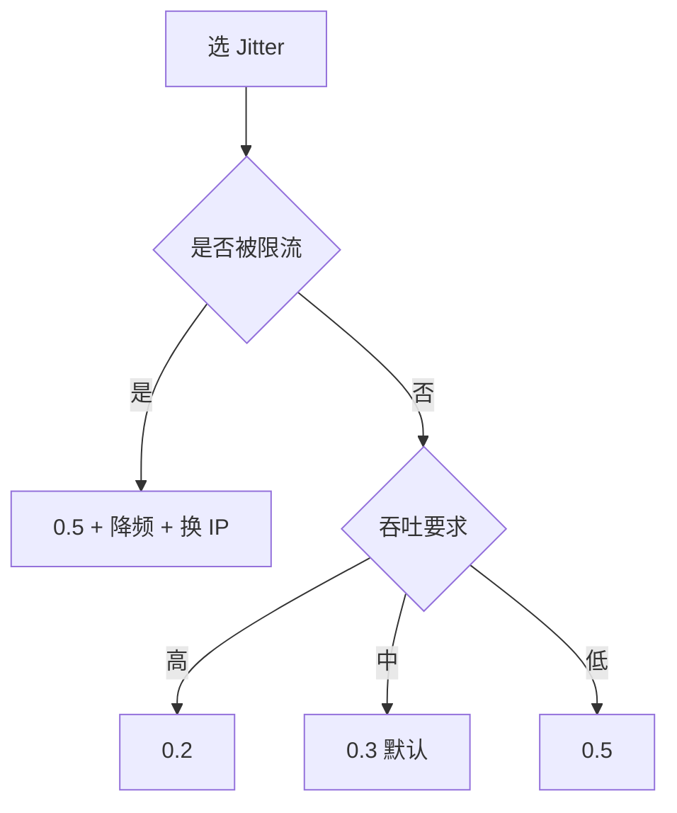

# Jitter 调参

Jitter（节奏抖动）让请求间隔随机化，降低机器化节奏特征。cnvd-skills 的 `Config.Jitter` 控制翻页/详情间隔的抖动范围。

## 配置

`Config.Jitter` 默认 0.3，表示间隔在 ±30% 范围内随机。如基础间隔 1 秒，Jitter=0.3 时实际间隔 0.7~1.3 秒随机。

## 抖动范围



## 调参建议

| 场景 | Jitter | 说明 |
|------|--------|------|
| 默认 | 0.3 | 平衡隐蔽性与吞吐 |
| 高频小批量 | 0.5 | 更大随机性，降低被识别 |
| 低频大批量 | 0.2 | 随机性足够，吞吐优先 |
| 调试 | 0 | 固定间隔，便于复现 |
| 被限流 | 0.5 + 降频 | 配合退避 |

## 选值决策



## go-jsl 内的抖动

go-jsl 内部验证码取图前有 500~1500ms 人类反应延迟（`processCaptcha`），这是独立的抖动，不受 `Config.Jitter` 控制。翻页/详情间隔的 Jitter 由 cnvd-skills 上层（`Config.Jitter`）控制，go-jsl 自身不涉及翻页节奏。

## 示例（cnvd-skills 侧）

```go
// cnvd-skills Config（示意）
config := cnvd_skills.DefaultConfig()
config.Jitter = 0.5
config.Interval = 2 * time.Second // 基础间隔
```

详见 cnvd-skills [Config 字段](/api-cnvd-skills/types/config-output)。

## 注意

- Jitter 过大（如 1.0）会让最短间隔趋近 0，可能触发限流。
- Jitter=0 时节奏固定，最易被识别，仅调试用。
- 抖动随机源同 [globalRand 内部](/api-gojsl/types/global-rand-internals)。

## 相关

- [被限流怎么办](/faq/rate-limit)
- [globalRand 内部](/api-gojsl/types/global-rand-internals)
- [processCaptcha 内部](/api-gojsl/methods/process-captcha-internals)
- [性能调优](/faq/performance)
