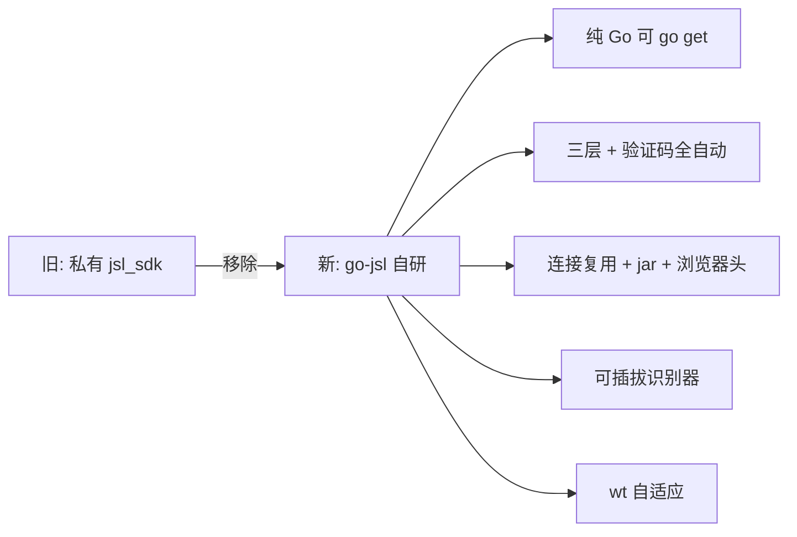

# 移除私有 jsl_sdk 原因

早期版本依赖私有 `jsl_sdk` 包做加速乐破解，现已移除并自研 `go-jsl`。本页说明原因与收益。

## 私有 jsl_sdk 的问题

| 问题 | 详情 |
|------|------|
| 不可 `go get` | 私有包，monorepo 外部项目无法直接引用 |
| 不可复用 | 仅服务 cnvd-skills CLI，无法作为通用库 |
| 维护耦合 | jsl_sdk 改动直接影响 cnvd-skills，反之亦然 |
| 实现局限 | 正则不兼容 `; Max-age`、硬编码 `wt=1500`、无验证码挑战处理 |

## 移除与自研收益

## 迁移要点

- 第二层算法（`secondLayerParams` + md5/sha1/sha256 暴力匹配）复刻自 jsl_sdk 的 `SecondResponseParams`，行为一致。
- 第一层正则升级为兼容 `; Max-age` 大小写与空格组合。
- `wt` 改为从响应解析（非硬编码 1500）。
- 新增验证码挑战全流程（`processCaptcha`）与可插拔 `CaptchaSolver`。

## 现状

go-jsl 作为 monorepo 内的独立 module（`github.com/scagogogo/go-jsl`），可被外部项目 `go get`，也可被 cnvd-skills 通过 replace 引用。详见 [monorepo replace](/faq/monorepo-replace)。

## 相关

- [为何自研加速乐客户端](/faq/why-self-implementation)
- [monorepo replace 机制](/faq/monorepo-replace)
- [secondLayerParams 第二层参数](/api-gojsl/types/second-layer-params)
- [三层解密深度解析](/api-gojsl/three-layers-deep-dive)
