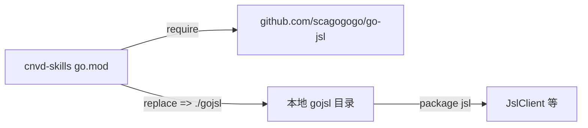

# monorepo replace 机制

go-jsl 是 monorepo（`github.com/scagogogo/cnvd-skills`）内的独立 module（`github.com/scagogogo/go-jsl`），通过 `replace` 机制被 cnvd-skills 引用。

## 模块布局

```
cnvd-skills/                      # monorepo 根
├── go.mod                        # module github.com/scagogogo/cnvd-skills
├── gojsl/
│   ├── go.mod                    # module github.com/scagogogo/go-jsl
│   └── ...                       # package jsl
└── ...
```

两个 `go.mod`，两个 module。

## replace 用法

cnvd-skills 根 `go.mod` 用 replace 指向本地 gojsl 目录：

```
module github.com/scagogogo/cnvd-skills

go 1.18

require github.com/scagogogo/go-jsl vX.Y.Z

replace github.com/scagogogo/go-jsl => ./gojsl
```



## 双重身份

- **monorepo 内**：cnvd-skills 通过 replace 引用本地 `./gojsl`，开发期改动即时生效。
- **独立使用**：外部项目 `go get github.com/scagogogo/go-jsl` 直接拉取（需 gojsl 已发布到模块代理或 GitHub tag）。

## 发布注意

发布新版本时需给 gojsl 单独打 tag（如 `gojsl/v0.1.0`），go.mod 的 `require` 版本号与 tag 对应。replace 仅在 monorepo 本地开发用，不发布到模块代理（replace 指令在 `go mod tidy` 时对外部消费者无效，外部走真实 require 版本）。

## 修改 gojsl

```bash
cd gojsl
# 改代码
go build ./...      # 验证 gojsl 独立可编译
cd ..
go build ./...      # 验证 cnvd-skills 引用正常
```

## 相关

- [独立使用示例](/api-gojsl/examples/standalone-use)
- [Go 1.18 兼容](/faq/go-1.18-compat)
- [源码编译](/faq/build-from-source)
- [README](https://github.com/scagogogo/cnvd-skills/blob/main/gojsl/README.md)
