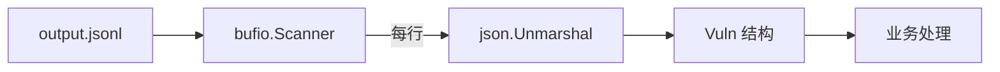

# JSONL 输出解析

cnvd-skills CLI 默认以 JSONL（每行一个 JSON 对象）输出抓取结果。本页说明格式与解析。

## 格式

每行一个独立 JSON，无尾随逗号、无数组包裹，便于流式处理与 `wc -l` 统计。

```jsonl
{"cnvd_id":"CNVD-2021-67823","title":"...","severity":"高",...}
{"cnvd_id":"CNVD-2021-67824","title":"...","severity":"中",...}
```

## 解析（Go）

```go
package main

import (
    "bufio"
    "encoding/json"
    "os"
)

type Vuln struct {
    CnvdID   string `json:"cnvd_id"`
    Title    string `json:"title"`
    Severity string `json:"severity"`
}

func main() {
    f, _ := os.Open("output.jsonl")
    defer f.Close()

    sc := bufio.NewScanner(f)
    sc.Buffer(make([]byte, 0, 64*1024), 1024*1024)
    for sc.Scan() {
        var v Vuln
        if err := json.Unmarshal(sc.Bytes(), &v); err != nil {
            continue
        }
        _ = v
    }
}
```

## 解析（jq）

```bash
# 取所有 cnvd_id
jq -r '.cnvd_id' output.jsonl

# 按严重级别过滤
jq -r 'select(.severity=="高") | .cnvd_id' output.jsonl

# 统计行数
wc -l output.jsonl
```

## 字段映射

字段对应 `VulDetail` / `VulListItem` 结构，详见 [cnvd-skills 字段速查](/api-cnvd-skills/fields-reference) 与 [VulDetail 字段](/api-cnvd-skills/types/vul-detail-fields)。

## 解析流程



## 大文件处理

JSONL 天然支持流式，无需全量加载到内存。用 `bufio.Scanner` 配合大缓冲（`sc.Buffer(..., 1<<20)`）处理超长行（如补丁内容）。

## 相关

- [cnvd-skills 字段速查](/api-cnvd-skills/fields-reference)
- [VulDetail 字段](/api-cnvd-skills/types/vul-detail-fields)
- [日期字段格式](/faq/date-format)
- [架构 - 输出格式](/guide/output-format)
