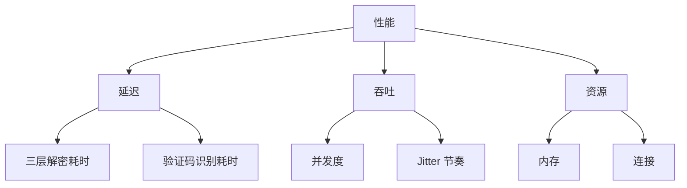
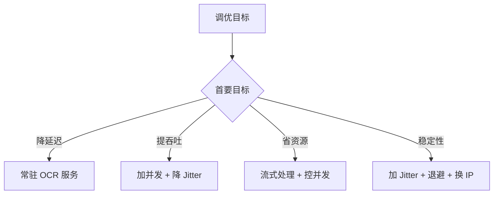

# 性能调优

go-jsl 与 cnvd-skills 的性能调优建议。

## 性能维度

## 延迟优化

### 三层解密

- 第一层 goja 求值：单次约 10-50ms，无法显著优化（JS 引擎固有）。
- 第二层暴力匹配：`chars` 平方复杂度，通常 chars 长度 16，256 次哈希，毫秒级。
- `wt` 休眠：不可避免（模拟浏览器延迟），但已扣除计算耗时 `cost`。

### 验证码识别

`CommandCaptchaSolver` 每次起新子进程，ddddocr 模型加载耗时 1-3 秒。优化：
- 自建常驻 OCR 服务 + 自定义 Solver（见 [自定义 Solver 示例](/api-gojsl/examples/custom-solver)）。
- 用更快 OCR 模型/硬件加速。

## 吞吐优化

### 并发度

每请求独立 `JslClient`（见 [并发安全](/faq/concurrent-safe)），用带缓冲 channel 控制并发数。建议 2-5 起步，观察限流。

### Jitter

`Jitter=0.3`（默认）平衡隐蔽性与吞吐。纯吞吐优先场景可降到 0.2，但易被限流。详见 [Jitter 调参](/faq/jitter-tuning)。

## 资源优化

### 连接复用

`HttpClient` 持有长生命周期 resty client，复用 TCP/TLS。不要每次请求 `NewHttpClient`，否则失去连接复用优势。但 `JslClient` 因 cookie jar 隔离需每请求新建（jar 在其内部 HttpClient）。

### 内存

- 响应体以 `string` 返回，大页面（如补丁全文）占内存。流式处理见 [JSONL 输出解析](/faq/output-jsonl-parse)。
- `cookieMap` 仅存少量解密 cookie，内存可忽略。

## 调优决策

## 基准

参考耗时（直连，无验证码）：
- 三层解密单次：约 2-5 秒（含 wt 休眠）。
- 含验证码（6 次内通过）：加 5-15 秒。

实际耗时受网络、代理、CNVD 响应速度影响。

## 相关

- [并发安全](/faq/concurrent-safe)
- [Jitter 调参](/faq/jitter-tuning)
- [被限流怎么办](/faq/rate-limit)
- [自定义 Solver 示例](/api-gojsl/examples/custom-solver)
- [JSONL 输出解析](/faq/output-jsonl-parse)
