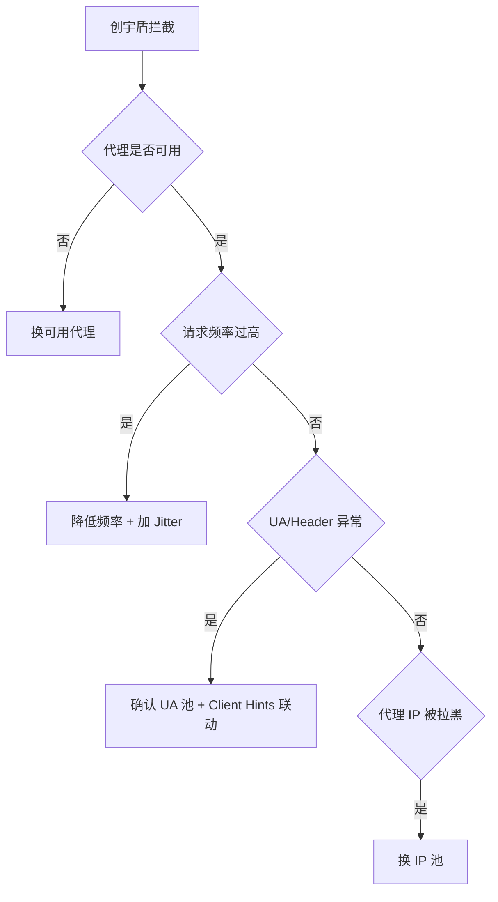

# 代理被封（创宇盾）排查

`plainRequest` 检测到响应体含 `当前访问疑似黑客攻击，已被创宇盾拦截。` 时返回 `blocked by 创宇盾 (proxy may be banned)`。本页给出排查步骤。

## 错误信息

```
blocked by 创宇盾 (proxy may be banned): https://www.cnvd.org.cn/...
```

## 排查决策树



## 常见原因

| 原因 | 排查 | 解决 |
|------|------|------|
| 代理失效 | `curl -x <proxy> https://www.cnvd.org.cn/` | 换可用代理 |
| 请求频率过高 | 检查循环间隔 | 降低频率，加 Jitter 抖动（见 [Jitter 调参](/faq/jitter-tuning)） |
| 单 IP 请求过多 | 同 IP 短时大量请求 | 用代理池轮换（见 [代理与超时示例](/api-gojsl/examples/proxy-timeout)） |
| UA 固定 | 检查是否复用同一 client | 长会话定期 `RefreshUserAgent`（见 [UA 轮换](/api-gojsl/examples/ua-rotation)） |
| 代理 IP 被 CNVD 拉黑 | 换 IP 测试 | 换 IP 池 |

## 验证代理

```bash
# 直连测试
curl -I https://www.cnvd.org.cn/

# 代理测试
curl -x http://127.0.0.1:7890 -I https://www.cnvd.org.cn/
```

若代理返回创宇盾页面，说明该 IP 已被识别。

## 每请求独立实例

并发场景为每个请求构造独立 `JslClient`，避免 cookie jar 串扰，也便于每请求用不同代理：

```go
func fetch(proxy, url string) (string, error) {
    c := jsl.NewJslClient(proxy, 30, solver)
    return c.Get(context.Background(), url)
}
```

详见 [并发安全](/faq/concurrent-safe)。

## 相关

- [代理与超时示例](/api-gojsl/examples/proxy-timeout)
- [Jitter 调参](/faq/jitter-tuning)
- [并发安全](/faq/concurrent-safe)
- [被限流怎么办](/faq/rate-limit)
